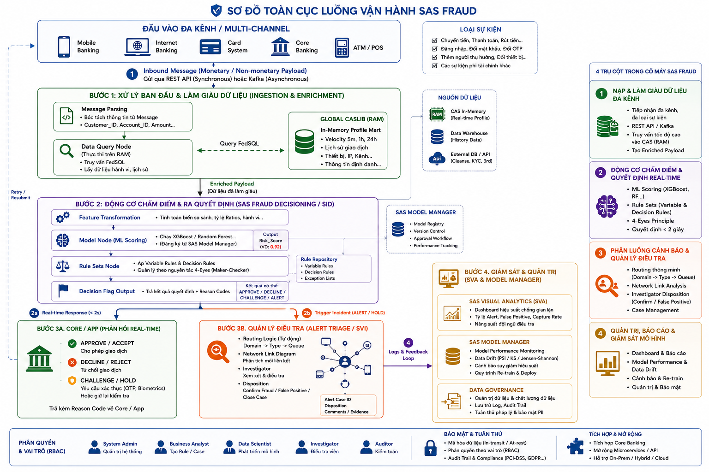
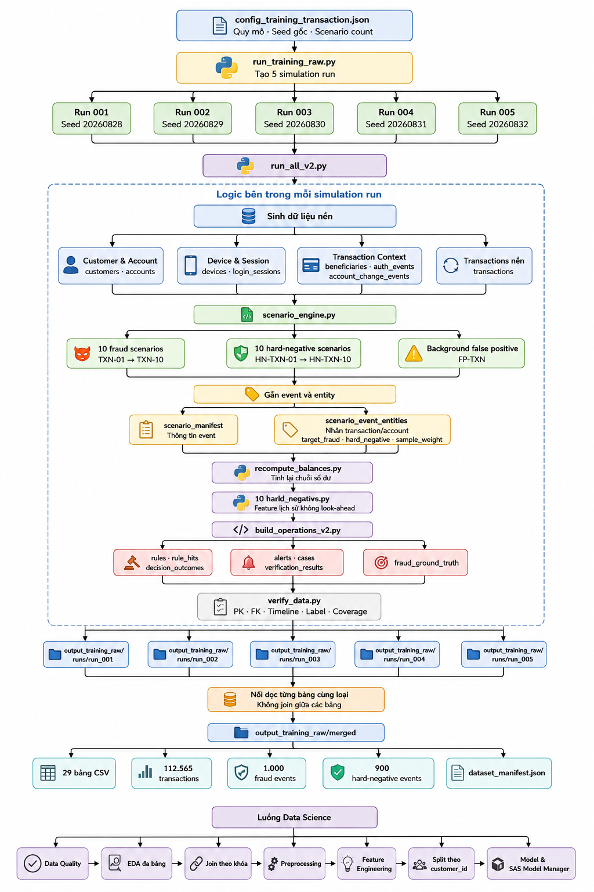
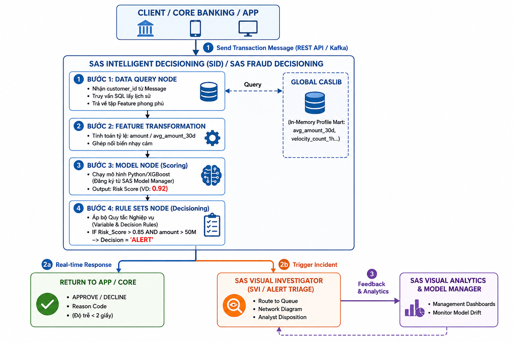
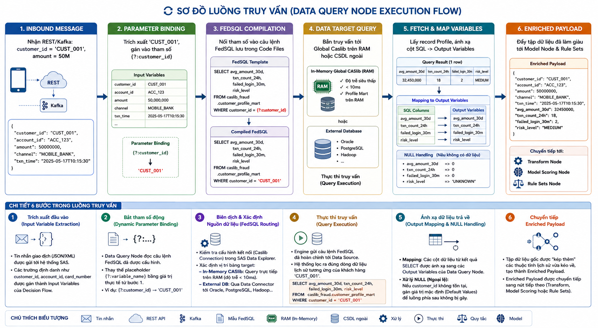
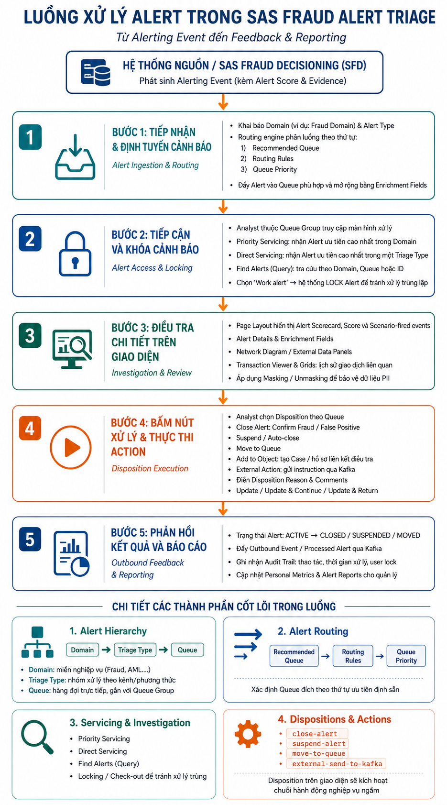
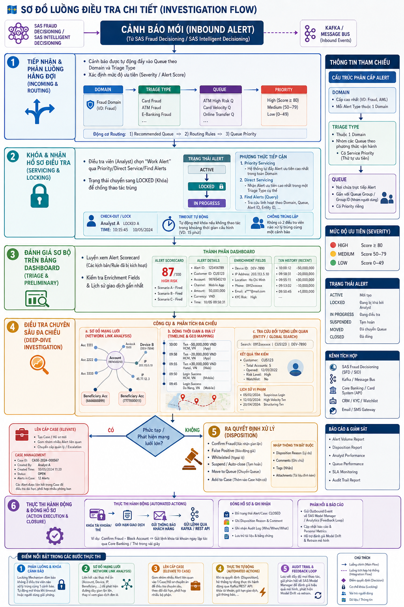

# SAS-FRAUD

> Mô phỏng hành trình phát hiện gian lận giao dịch: từ sinh dữ liệu, xây dựng mô hình, chấm điểm thời gian thực đến phân luồng cảnh báo, điều tra và phản hồi kết quả.

Repository gồm hai lớp bổ trợ cho nhau:

- **Phần có thể thực thi:** generator dữ liệu synthetic, data contract, notebook Data Science và các kiểm tra chất lượng.
- **Kiến trúc đích:** cách các thành phần SAS Fraud Decisioning, SAS Intelligent Decisioning, SAS Visual Investigator, SAS Visual Analytics và SAS Model Manager phối hợp trong vận hành thực tế.

## Mục lục

1. [Bức tranh toàn cục](#1-bức-tranh-toàn-cục)
2. [Dữ liệu huấn luyện được tạo ra như thế nào?](#2-dữ-liệu-huấn-luyện-được-tạo-ra-như-thế-nào)
3. [Mô hình tham gia quyết định ở đâu?](#3-mô-hình-tham-gia-quyết-định-ở-đâu)
4. [Dữ liệu được truy vấn và làm giàu ra sao?](#4-dữ-liệu-được-truy-vấn-và-làm-giàu-ra-sao)
5. [Cảnh báo được phân luồng như thế nào?](#5-cảnh-báo-được-phân-luồng-như-thế-nào)
6. [Điều tra viên đi đến kết luận ra sao?](#6-điều-tra-viên-đi-đến-kết-luận-ra-sao)
7. [Scope Data Science hiện tại](#7-scope-data-science-hiện-tại)
8. [Bắt đầu với repository](#8-bắt-đầu-với-repository)
9. [Cấu trúc dự án](#9-cấu-trúc-dự-án)

---

## 1. Bức tranh toàn cục

Một giao dịch bắt đầu từ Mobile Banking, Internet Banking, Card System, Core Banking hoặc ATM/POS. Message được gửi qua REST API hoặc Kafka, sau đó đi qua bốn trụ cột:

1. **Nạp và làm giàu dữ liệu:** phân tích message, truy vấn lịch sử và tạo enriched payload.
2. **Chấm điểm và quyết định:** biến đổi feature, chạy model, áp dụng rule rồi trả về quyết định cùng reason code.
3. **Quản lý cảnh báo và điều tra:** định tuyến alert, phân tích quan hệ và ghi nhận disposition.
4. **Quản trị và giám sát:** theo dõi hiệu năng, model drift, audit trail và vòng phản hồi.



Luồng có hai nhánh kết quả song song:

- **Phản hồi thời gian thực:** `APPROVE`, `DECLINE`, `CHALLENGE` hoặc `HOLD` về Core/App.
- **Điều tra sau quyết định:** tạo alert/case khi sự kiện cần analyst xem xét.

Đây là kiến trúc đích của hệ thống. Repository hiện tập trung sâu nhất vào dữ liệu huấn luyện và luồng Data Science trước khi model được đăng ký, triển khai và giám sát trên SAS.

---

## 2. Dữ liệu huấn luyện được tạo ra như thế nào?

Không sử dụng dữ liệu khách hàng thật, dự án sinh dữ liệu synthetic theo scenario có kiểm soát. File cấu hình xác định quy mô, seed và số lượng scenario; `run_training_raw.py` tạo năm simulation run độc lập rồi ghép dọc các bảng cùng loại.



Trong mỗi run:

1. Sinh population nền gồm customer, account, device, session, beneficiary và transaction.
2. `scenario_engine.py` tiêm fraud scenario, hard-negative và background false-positive.
3. Gắn event với entity qua `scenario_manifest` và `scenario_event_entities`.
4. Tính lại balance, feature lịch sử không look-ahead và các bảng mô phỏng vận hành.
5. `verify_data.py` kiểm tra PK/FK, timeline, label và coverage trước khi cho phép merge.

Snapshot hiện tại gồm năm run với 29 bảng CSV và 112.565 transaction raw. Con số **1.000 fraud event** và **900 hard-negative event** trong sơ đồ là event-level; ở transaction grain, một event có thể sinh nhiều transaction. Thống kê model population và quy tắc gán nhãn chi tiết nằm trong [Business Domain Guide](docs/business_domain.md).

Luồng Data Science bắt đầu sau bước merge:

```text
Data Quality → EDA → Join theo khóa → Preprocessing
             → Feature Engineering → Entity-safe Split → Model
```

---

## 3. Mô hình tham gia quyết định ở đâu?

Model không tự đưa ra toàn bộ quyết định nghiệp vụ. Nó là một mắt xích trong decision flow:



1. **Data Query Node** nhận định danh từ transaction message và lấy profile/lịch sử liên quan.
2. **Feature Transformation** tạo biến tại thời điểm scoring, ví dụ `amount / avg_amount_30d`.
3. **Model Node** trả về xác suất hoặc `risk_score`.
4. **Rule Sets Node** kết hợp score với điều kiện nghiệp vụ để tạo quyết định cuối.

Ví dụ: model đánh giá rủi ro cao chưa nhất thiết đồng nghĩa với fraud đã được xác nhận. Rule có thể kết hợp `risk_score`, số tiền, kênh giao dịch và policy để chọn `ALERT`, `CHALLENGE`, `DECLINE` hoặc `APPROVE`.

Vì vậy, trách nhiệm của model là **xếp hạng rủi ro có khả năng tổng quát hóa**, còn decisioning chịu trách nhiệm chuyển risk thành hành động có thể kiểm soát và giải thích.

---

## 4. Dữ liệu được truy vấn và làm giàu ra sao?

Những feature như trung bình số tiền 30 ngày hoặc số giao dịch trong 24 giờ không nên tính lại từ toàn bộ lịch sử ngay trong mỗi request. Luồng mục tiêu duy trì các profile/aggregate phù hợp trong Global Caslib hoặc data source đã chuẩn bị trước, sau đó truy vấn theo entity tại thời điểm scoring.



Một truy vấn đi qua sáu bước:

1. Nhận transaction message từ REST/Kafka.
2. Bind động `customer_id`, `account_id` và các input khác.
3. Biên dịch FedSQL và xác định data source.
4. Truy vấn Caslib in-memory hoặc database ngoài.
5. Map SQL columns sang output variables, đồng thời xử lý `NULL`.
6. Ghép kết quả vào enriched payload cho Transform, Model và Rule Sets Node.

Data Query Node chủ yếu **lấy dữ liệu đã sẵn sàng để scoring**. Các aggregate phức tạp cần được định nghĩa nhất quán giữa training và serving, có cửa sổ thời gian rõ ràng và tuyệt đối không dùng dữ liệu xảy ra sau `transaction_at=T`.

---

## 5. Cảnh báo được phân luồng như thế nào?

Khi decision flow phát sinh alert, SAS Visual Investigator tiếp nhận alert kèm score, reason code và evidence. Alert không đi thẳng tới một analyst bất kỳ mà được phân cấp và định tuyến.



Vòng đời alert gồm:

1. **Ingestion & Routing:** phân loại theo Domain → Triage Type → Queue và mức ưu tiên.
2. **Access & Locking:** analyst nhận việc; alert được khóa để tránh xử lý trùng.
3. **Investigation & Review:** xem scorecard, enrichment fields, lịch sử và network diagram.
4. **Disposition Execution:** xác nhận fraud/false positive, suspend, chuyển queue hoặc tạo case.
5. **Feedback & Reporting:** đóng trạng thái, lưu audit trail và gửi kết quả về hệ thống phân tích.

Triage biến đầu ra kỹ thuật của model thành một hàng đợi công việc có SLA, quyền truy cập và dấu vết kiểm toán rõ ràng.

---

## 6. Điều tra viên đi đến kết luận ra sao?

Alert score chỉ là điểm bắt đầu. Điều tra viên cần ghép nhiều lớp bằng chứng trước khi ra disposition.



Hành trình điều tra chi tiết:

1. Alert được route vào queue theo loại gian lận, mức độ rủi ro và độ ưu tiên.
2. Analyst nhận và khóa alert, chuyển trạng thái sang `IN PROGRESS`.
3. Dashboard cung cấp scorecard, scenario/rule đã kích hoạt, enrichment và giao dịch gần nhất.
4. Analyst phân tích network, timeline, vị trí địa lý và các đối tượng liên quan.
5. Nếu vụ việc phức tạp, alert được nâng thành case; nếu đủ bằng chứng, analyst chọn disposition.
6. Hệ thống thực thi hành động, đóng hồ sơ, lưu audit và đưa kết quả vào feedback loop.

Feedback này có giá trị cho:

- Đo false-positive và hiệu quả của từng rule/model.
- Theo dõi năng suất, SLA và chất lượng điều tra.
- Phát hiện drift và lên lịch retraining.
- Tạo label thực tế cho các chu kỳ model tiếp theo sau khi đã qua kiểm soát chất lượng.

---

## 7. Scope Data Science hiện tại

| Thuộc tính | Scope |
|---|---|
| Domain | Transaction/Account Fraud |
| Bài toán | Binary classification: fraud hay legitimate |
| Grain | Một dòng là một transaction tại `transaction_at=T` |
| Target | `target_fraud ∈ {0,1}` |
| Label bridge | `scenario_event_entities.csv` |
| Fraud scenario | `TXN-01..TXN-10`; TXN-03 là account-level context-only |
| Hard-negative | Legitimate nhưng có hành vi gần giống fraud |
| Split | Theo customer/account, không để entity rò giữa các tập |

Các nguyên tắc bắt buộc:

- Chỉ feature biết được tại thời điểm `T` mới được đưa vào model.
- Không suy label từ ID, tên scenario, rule hit, alert, case hoặc kết quả xác minh.
- Không dùng operations/ground-truth tables làm model input.
- Imputer, encoder, scaler, resampler và feature selector chỉ được fit trên train.
- Đánh giá không chỉ bằng accuracy; cần PR-AUC, recall theo scenario, false-positive rate trên hard-negative và threshold theo chi phí nghiệp vụ.

Lộ trình notebook:

- `notebooks/00_business_rule.ipynb`: xác nhận scope, grain, label contract và rule baseline.
- `notebooks/01_data_quality.ipynb`: kiểm tra schema, khóa, timeline, coverage và chất lượng dữ liệu.
- Các notebook tiếp theo: EDA, preprocessing, feature engineering, entity-safe split, modeling và evaluation.

Quy ước trình bày notebook và biểu đồ nằm tại [docs/SKILLS.md](docs/SKILLS.md).

---

## 8. Bắt đầu với repository

### Yêu cầu

- Python 3.11
- Git
- Virtual environment được khuyến nghị

### Cài đặt

Windows PowerShell:

```powershell
py -3.11 -m venv .venv
.\.venv\Scripts\Activate.ps1
python -m pip install --upgrade pip
pip install -r requirements.txt
Copy-Item .env.example .env
```

macOS/Linux:

```bash
python3.11 -m venv .venv
source .venv/bin/activate
python -m pip install --upgrade pip
pip install -r requirements.txt
cp .env.example .env
```

### Sinh lại training data

```powershell
cd fraud_data_generator_v2
python run_training_raw.py
```

Output merged được tạo tại:

```text
fraud_data_generator_v2/output_training_raw/merged/
```

Không chỉnh trực tiếp CSV sinh ra để sửa lỗi logic; hãy sửa generator/preprocessing source và chạy lại verification.

### Chạy notebook

Từ repository root:

```bash
jupyter lab
```

Notebook cần chạy từ trên xuống trong kernel sạch. Logic và visual dùng chung nên đặt trong `notebooks/src/`.

### Kiểm tra code

```bash
pytest
black .
ruff check .
```

---

## 9. Cấu trúc dự án

```text
SAS-FRAUD/
├── app/                         # Backend, frontend và ứng dụng demo
├── data/                        # Dữ liệu local; không commit dữ liệu thật
├── database/                    # Schema, migration, query và seed
├── docs/                        # Business guide, kiến trúc và hình minh họa
├── fraud_data_generator_v2/     # Generator, scenario engine và raw outputs
├── notebooks/                   # Data Science workflow
│   └── src/                     # Helper và design system dùng chung
├── tests/                       # Automated tests
├── AGENTS.md                    # Quy tắc làm việc của Codex trong repository
├── requirements.txt
└── README.md
```

Tài liệu nên đọc tiếp:

- [Business Domain Guide](docs/business_domain.md): scope dataset, label contract, EDA và preprocessing.
- [Raw Transaction Dataset](fraud_data_generator_v2/RAW_TRANSACTION_DATASET.md): contract của các bảng sinh ra.
- [Notebook Playbook](docs/SKILLS.md): cấu trúc notebook và storytelling bằng dữ liệu.
- [SAS field mapping](database/schema/Mapping_Generator_Fields.md): ánh xạ dữ liệu generator sang SAS.

## Bảo mật và quản trị

- Không commit credential, token, connection string, PII hoặc dữ liệu giao dịch thật.
- Dữ liệu demo phải là synthetic hoặc đã được ẩn danh.
- Log và hình ảnh cần masking thông tin định danh.
- Rule/model phải có reason code, version, audit trail và khả năng tái lập.
- Mọi feedback từ investigator cần được kiểm soát chất lượng trước khi dùng làm nhãn huấn luyện.
