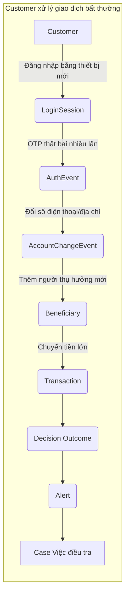

# Tóm tắt chung

Hệ thống **Fraud/Loan Simulation** hiện tại được chia thành ba lớp chính: **Cơ sở (shared foundation)**, **luồng gian lận giao dịch (Transaction/Account Fraud)** và **luồng hồ sơ vay (Loan Application Fraud)**, cộng thêm **lớp điều hành (Fraud Operation)**. Theo thiết kế, mỗi bảng dữ liệu tập trung vào một đối tượng nghiệp vụ cụ thể (khách hàng, tài khoản, thiết bị, giao dịch, hồ sơ vay, v.v.), đồng thời liên kết chặt chẽ qua các khóa chính/ngoại để phản ánh chuỗi sự kiện. Ví dụ, **customer** → **login_session** → **account_change_event** → **beneficiary** → **transaction** → **decision_outcome** → **alert** → **case** thể hiện luồng **Account Takeover** điển hình; tương tự **customer** → **loan_application** → **employment_income_profile/docs** → **disbursement_account** → **loan_repayment_outcome** thể hiện luồng **Loan Fraud** (nguyên mẫu).

Các bảng đã bao phủ hầu hết các kịch bản **ATO (Account Takeover)** và **Loan Fraud** cơ bản: đăng nhập thiết bị mới, thêm thụ hưởng mới, chuyển tiền lạ, thu nhập khai giả, xác minh giấy tờ giả, chia nhỏ lãi (loan stacking), tài khoản chung giải ngân, v.v. Kết cấu tách biệt **sự kiện thô** (raw events) và **đặc trưng dẫn xuất** giúp giả lập và tính năng hóa dữ liệu dễ dàng. Ví dụ, bảng `transactions` chỉ chứa giao dịch gốc, còn `transaction_features` lưu các biến đặc trưng như “giao dịch đến ngay sau thay đổi thông tin nhạy cảm”.

Tuy nhiên, một số điểm cần hoàn thiện **ngay trước khi tạo bộ dữ liệu chính thức**: đảm bảo toàn vẹn tham chiếu (ví dụ transaction–beneficiary, agent–sales point, application–profile), cô lập dữ liệu theo lần mô phỏng (`simulation_run_id`), bổ sung bảng `rule_hits` để theo dõi chi tiết rule, và tối ưu hóa một số trường để giảm nhầm lẫn. Bảng cuối cùng **loan_repayment_outcomes** mới chỉ khung sơ khởi và cần định nghĩa rõ nhãn huấn luyện (separating credit default vs fraud). Ở các mục sau đây, mỗi bảng sẽ được phân tích chi tiết về **mục đích**, **cột**, **khóa chính/ngoại**, **ví dụ dữ liệu**, **truy vấn minh họa**, và **ràng buộc đề xuất**.

---

# Sơ đồ ER chung (Chi tiết FK/PK)

```mermaid
erDiagram
    SIMULATION_RUNS ||--o{ CUSTOMERS : has
    SIMULATION_RUNS ||--o{ ACCOUNTS : has
    SIMULATION_RUNS ||--o{ DEVICES : has
    SIMULATION_RUNS ||--o{ LOGIN_SESSIONS : has
    SIMULATION_RUNS ||--o{ AUTH_EVENTS : has
    SIMULATION_RUNS ||--o{ ACCOUNT_CHANGE_EVENTS : has
    SIMULATION_RUNS ||--o{ BENEFICIARIES : has
    SIMULATION_RUNS ||--o{ TRANSACTIONS : has
    SIMULATION_RUNS ||--o{ TRANSACTION_FEATURES : has
    SIMULATION_RUNS ||--o{ LOAN_APPLICATIONS : has
    SIMULATION_RUNS ||--o{ LOAN_REPAYMENT_OUTCOMES : has
    SIMULATION_RUNS ||--o{ RULES : has
    SIMULATION_RUNS ||--o{ RULE_HITS : has
    SIMULATION_RUNS ||--o{ DECISION_OUTCOMES : has
    SIMULATION_RUNS ||--o{ ALERTS : has
    SIMULATION_RUNS ||--o{ CASES : has
    SIMULATION_RUNS ||--o{ FRAUD_GROUND_TRUTH : has

    CUSTOMERS ||--o{ ACCOUNTS : owns
    CUSTOMERS ||--o{ LOAN_APPLICATIONS : applies
    CUSTOMERS ||--o{ CASES : owner

    ACCOUNTS ||--o{ BENEFICIARIES : has
    ACCOUNTS ||--o{ TRANSACTIONS : records

    DEVICES ||--o{ LOGIN_SESSIONS : used_in
    DEVICES ||--o{ TRANSACTIONS : initiated_by

    LOGIN_SESSIONS ||--o{ AUTH_EVENTS : includes
    LOGIN_SESSIONS ||--o{ TRANSACTIONS : precedes

    ACCOUNT_CHANGE_EVENTS ||--o{ TRANSACTIONS : precedes
    ACCOUNT_CHANGE_EVENTS ||--o{ AUTH_EVENTS : includes

    BENEFICIARIES ||--o{ TRANSACTIONS : destination

    LOAN_APPLICATIONS ||--o{ APPLICANT_DECLARED_PROFILES : has
    LOAN_APPLICATIONS ||--o{ EMPLOYMENT_INCOME_PROFILES : has
    LOAN_APPLICATIONS ||--o{ REFERENCE_CONTACTS : has
    LOAN_APPLICATIONS ||--o{ DISBURSEMENT_ACCOUNTS : has
    LOAN_APPLICATIONS ||--o{ CASES : maybe_referred_in

    SALES_POINTS ||--o{ LOAN_APPLICATIONS : available_at
    SALES_AGENTS ||--o{ LOAN_APPLICATIONS : submits

    RULES ||--o{ RULE_HITS : triggers
    RULES ||--o{ ALERTS : triggers
    DECISION_OUTCOMES ||--o{ ALERTS : influences
    ALERTS ||--o{ CASES : grouped_in

    LOAN_APPLICATIONS ||--o{ LOAN_REPAYMENT_OUTCOMES : outcome_for

    FRAUD_GROUND_TRUTH ||--|| TRANSACTIONS : labels
    FRAUD_GROUND_TRUTH ||--|| LOAN_APPLICATIONS : labels
```



---

# Luồng nghiệp vụ chính

## 1. Luồng gian lận giao dịch (Account Takeover)



Dòng chảy này mô phỏng **Account Takeover**: khách đăng nhập lạ, trải qua nhiều lần xác thực thất bại, thay đổi thông tin, thêm thụ hưởng mới rồi chuyển tiền lớn. Hệ thống thu thập sự kiện ở từng bước (login_sessions, auth_events, account_change_events, beneficiaries, transactions), tính toán đặc trưng (transaction_features), rồi đánh giá với bộ luật và mô hình (rules → rule_hits → decision_outcomes) để phát sinh cảnh báo (alerts) và cã thu thập (cases) nếu cần. Đây là quy trình điển hình cho các ngân hàng phát hiện giao dịch bất thường thông qua **theo dõi giao dịch liên tục**.

## 2. Luồng hồ sơ vay và theo dõi trả nợ

```mermaid
flowchart LR
    subgraph Hồ sơ vay tiêu dùng
        G[Customer] -->|Nộp hồ sơ vay| H(LoanApplication)
        H --> Profile[Declared Profile]
        H --> Income[Employment & Income]
        H --> Docs[Document Verification]
        H --> Score[CIC Snapshot, Credit Score]
        H --> Underwrite[Kết quả thẩm định]
        Underwrite --> Disburse[Giải ngân (Disbursement)]
        Disburse --> LoanOutcome[LoanRepaymentOutcome]
        LoanOutcome --> Alert2[Alert nếu gian lận]
    end
```

Luồng này mô phỏng quy trình **hồ sơ vay tín dụng**: khách nộp đơn (loan_applications) kèm thông tin cá nhân khai báo (applicant_declared_profiles), nghề nghiệp & thu nhập (employment_income_profiles), giấy tờ. Ngân hàng đánh giá (underwriting), giải ngân sang tài khoản (disbursement_accounts). Sau một kỳ thanh toán đầu tiên, hệ thống theo dõi trạng thái trả nợ (loan_repayment_outcomes). Nếu thấy dấu hiệu khả nghi (ví dụ trả tiền trễ, mất liên lạc, cùng tài khoản nhận tiền lạ, thói quen giả lập), sẽ tạo cảnh báo gian lận. Đây phản ánh nguyên tắc “để ý đến hồ sơ trùng lặp/nghi vấn trong mạng lưới” và “dữ liệu CIC” thường dùng trong đánh giá tín dụng, tương tự khái niệm synthetic identity hay loan stacking.

---

## Lời dẫn học thuật

Hệ thống **giám sát giao dịch** (Transaction monitoring) như thế này là một ví dụ của ứng dụng _Fraud Detection_, nhằm phát hiện hành vi bất thường (ví dụ “giao dịch với tần suất cao, vị trí địa lý đột ngột, giá trị lớn” như mô tả trong tài liệu). Các ràng buộc dữ liệu (PK, FK, UNIQUE, CHECK) được sử dụng để đảm bảo tính toàn vẹn và chất lượng dữ liệu nhập. Ví dụ, ràng buộc **CHECK** cho phép chắc chắn giá trị một cột thỏa mãn điều kiện nhất định, trong khi **UNIQUE**/**PRIMARY KEY** đảm bảo sự duy nhất, **FOREIGN KEY** đảm bảo tham chiếu hợp lệ.

---

# 1. Bảng chung (Shared foundation)

### 1.1 `simulation_runs`

- **Vai trò:** Lưu meta thông tin về mỗi lần **tạo mô phỏng dữ liệu**, bao gồm seed, phiên bản, cấu hình và trạng thái chạy. Giúp tái tạo và so sánh nhiều bộ dữ liệu khác nhau.
- **PRIMARY KEY:** `simulation_run_id`.
- **Các cột chính:**
  - `simulation_run_id TEXT PRIMARY KEY`: định danh duy nhất.
  - `dataset_version TEXT`: phiên bản/milestone.
  - `random_seed INTEGER`: hạt giống random (để tái tạo kết quả).
  - `run_status TEXT NOT NULL`: trạng thái (`RUNNING`, `COMPLETED`, `FAILED`).
  - `started_at TIMESTAMPTZ NOT NULL`, `completed_at TIMESTAMPTZ`.
  - `configuration JSONB`: JSON lưu cấu hình (số người, tỉ lệ gian lận, tham số generator).
  - `created_by TEXT`: người khởi chạy mô phỏng.
- **Ví dụ cột:** `run_status` như `'COMPLETED'`, `dataset_version`='v1.0', `random_seed`=42.
- **Tính nguyên:** ràng buộc gợi ý:
  ```sql
  CHECK (completed_at IS NULL OR completed_at >= started_at),
  CHECK (
    (run_status = 'RUNNING' AND completed_at IS NULL)
    OR run_status IN ('COMPLETED','FAILED')
  )
  ```
  (Giúp đảm bảo thời gian và trạng thái không mâu thuẫn).
- **CREATE DDL mẫu:**
  ```sql
  CREATE TABLE fraud_sim.simulation_runs (
      simulation_run_id TEXT PRIMARY KEY,
      dataset_version TEXT NOT NULL,
      random_seed INTEGER NOT NULL,
      run_status TEXT NOT NULL CHECK (run_status IN ('RUNNING','COMPLETED','FAILED')),
      started_at TIMESTAMPTZ NOT NULL DEFAULT CURRENT_TIMESTAMP,
      completed_at TIMESTAMPTZ,
      configuration JSONB,
      created_by TEXT
      -- CHECK constraints như trên
  );
  ```
- **Ví dụ dữ liệu:**
  ```sql
  INSERT INTO fraud_sim.simulation_runs
  VALUES ('RUN_001', 'v0.1', 2026, 'COMPLETED',
          '2026-08-01 08:00', '2026-08-01 08:01',
          '{"customers":1000,"fraud_rate":0.05}', 'analyst1');
  ```
- **Truy vấn ví dụ:** Liệt kê các bộ data đã hoàn thành:
  ```sql
  SELECT simulation_run_id, dataset_version, run_status
  FROM fraud_sim.simulation_runs
  WHERE run_status = 'COMPLETED';
  ```
- **Gợi ý cải tiến:**
  - Ràng buộc thời gian trạng thái như trên để tránh giá trị sai.
  - Giới hạn kiểu giá trị `run_status` (ENUM/CHK) đã có.
  - Đặt unique `(dataset_version, simulation_run_id)` nếu muốn ngăn lặp tên.
  - Đảm bảo nếu `run_status='RUNNING'` thì `completed_at` **phải** NULL (xem CHECK mẫu).

### 1.2 `customers`

- **Vai trò:** Danh mục khách hàng. Một **khách hàng** (cá nhân/SME/corporate) gắn với nhiều tài khoản, hồ sơ vay, cảnh báo, v.v.
- **PRIMARY KEY:** `customer_id`.
- **Cột chính và ý nghĩa:**
  - `customer_id TEXT PRIMARY KEY`: ID khách hàng.
  - `customer_type TEXT NOT NULL`: loại (ví dụ `'individual'`, `'sme'`, `'corporate'`).
  - `full_name TEXT`: họ tên.
  - `dob DATE`: ngày sinh (cá nhân).
  - `gender TEXT`: giới tính.
  - `id_number_hash TEXT`: hash số ID (CMND/CCCD, mã hóa).
  - `phone_hash TEXT`, `email_hash TEXT`: thông tin liên hệ đã hash.
  - `address_cluster_id TEXT`: mã cụm địa chỉ (nhiều khách cùng khu).
  - `phone_cluster_id TEXT`: mã cụm điện thoại (điện thoại tái sử dụng).
  - `occupation_group TEXT`: nhóm nghề nghiệp.
  - `income_band TEXT`: mức thu nhập ước tính.
  - `kyc_level TEXT`: cấp độ xác thực KYC.
  - `base_risk_level TEXT`: rủi ro cơ bản theo quy định.
  - `is_synthetic_identity_seed BOOLEAN`: cờ đánh dấu tài khoản giả (để đối chiếu).
  - `is_mule_candidate_seed BOOLEAN`: cờ đánh dấu ứng viên mule (để đối chiếu).
- **Cột ví dụ:** `customer_type='individual'`, `full_name='Nguyễn Văn A'`, `id_number_hash='HASH123...'`.
- **Tính nguyên:**
  - **Giới hạn theo loại khách:** Nếu yêu cầu chỉ cá nhân, có thể thêm:
    ```sql
    CHECK (customer_type = 'individual')
    ```
    hoặc cho phép SME/corporate nhưng cho `dob, gender, occupation_group` NULL khi không phù hợp.
  - **UNIQUE**: Có thể unique trên `(id_number_hash)` để mỗi khách dùng số ID khác nhau. Nếu cho phép cùng ID chỉ xuất hiện một khách hàng duy nhất:
    ```sql
    UNIQUE (simulation_run_id, id_number_hash)
    ```
    theo ranh giới dataset-run (xem lưu ý về isolation run phía dưới).
- **CREATE DDL mẫu:**
  ```sql
  CREATE TABLE fraud_sim.customers (
      customer_id TEXT PRIMARY KEY,
      customer_type TEXT NOT NULL CHECK (customer_type IN ('individual','sme','corporate')),
      full_name TEXT NOT NULL,
      dob DATE,
      gender TEXT,
      id_number_hash TEXT NOT NULL,
      phone_hash TEXT NOT NULL,
      email_hash TEXT,
      address_cluster_id TEXT,
      phone_cluster_id TEXT,
      occupation_group TEXT,
      income_band TEXT,
      kyc_level TEXT,
      base_risk_level TEXT,
      is_synthetic_identity_seed BOOLEAN NOT NULL DEFAULT FALSE,
      is_mule_candidate_seed BOOLEAN NOT NULL DEFAULT FALSE
      -- Consider UNIQUE(sim_run, id_number_hash), etc.
  );
  ```
- **Ví dụ dữ liệu:**
  ```sql
  INSERT INTO fraud_sim.customers
    (customer_id, customer_type, full_name, dob, gender,
     id_number_hash, phone_hash, address_cluster_id, phone_cluster_id,
     occupation_group, income_band, kyc_level, base_risk_level,
     is_synthetic_identity_seed, is_mule_candidate_seed)
  VALUES (
    'CUST_0001', 'individual', 'Nguyen Van A', '1985-05-15', 'Male',
    'HASH_ID_123', 'HASH_PH_456', 'ADDR_CL_01', 'PH_CL_10',
    'Engineer', '15-25M', 'standard', 'low', false, false
  );
  ```
- **Truy vấn ví dụ:** Tìm khách hàng có ngưỡng rủi ro cao:
  ```sql
  SELECT customer_id, full_name, base_risk_level
  FROM fraud_sim.customers
  WHERE base_risk_level = 'high';
  ```
- **Gợi ý cải tiến:**
  - Nếu giả lập chỉ cá nhân, giới hạn `customer_type='individual'` (P0).
  - Nếu SME/corporate, cho phép NULL với các trường cá nhân (`dob`, `gender`...), hoặc thêm ràng buộc ràng “nếu type='corporate' thì dob IS NULL” (P1).
  - Tránh **leakage**: cột `is_synthetic_identity_seed` chỉ dùng nội bộ cho generator, không đưa vào mô hình hay báo cáo (giữ tính riêng tư).
  - Tất cả UNIQUE nên xét theo `simulation_run_id` nếu mỗi run độc lập (xem mục sau).

### 1.3 `accounts`

- **Vai trò:** Quản lý tài khoản ngân hàng của khách (có thể là tài khoản thanh toán, tiết kiệm, vay,...). Dữ liệu này dùng để phát hiện: account takeover, transaction velocity, dormant account, v.v.
- **PRIMARY KEY:** `account_id`.
- **Cột chính:**
  - `account_id TEXT PRIMARY KEY`.
  - `customer_id TEXT NOT NULL`: FK → `customers(customer_id)`.
  - `account_no_hash TEXT UNIQUE NOT NULL`: hash số tài khoản.
  - `status TEXT`: trạng thái (`active`, `closed`, `dormant`...).
  - `open_date DATE`: ngày mở.
  - `account_opening_channel TEXT`: kênh mở (online, branch).
  - `daily_transfer_limit NUMERIC(18,2)`: hạn mức ngày.
  - `single_txn_limit NUMERIC(18,2)`: hạn mức 1 giao dịch.
  - `average_balance_30d NUMERIC(18,2)`: trung bình số dư 30 ngày.
- **Cột ví dụ:** `status='active'`, `daily_transfer_limit=100000000`, `average_balance_30d=50000000`.
- **Tính nguyên:**
  - Có thể thêm `CHECK (daily_transfer_limit >= 0 AND single_txn_limit >= 0)`.
  - (Nếu tính lock down, `CHECK (balance >= 0)` từng thời điểm thì phức tạp do fees, nên kiểm tra riêng.)
  - Nếu muốn chính xác theo run, UNIQUE `(simulation_run_id, account_no_hash)` thay vì global unique (xem lưu ý).
- **CREATE DDL mẫu:**
  ```sql
  CREATE TABLE fraud_sim.accounts (
      account_id TEXT PRIMARY KEY,
      customer_id TEXT NOT NULL REFERENCES fraud_sim.customers(customer_id),
      account_no_hash TEXT NOT NULL,
      status TEXT NOT NULL CHECK (status IN ('active','closed','dormant','blocked')),
      open_date DATE NOT NULL,
      account_opening_channel TEXT,
      daily_transfer_limit NUMERIC(18,2),
      single_txn_limit NUMERIC(18,2),
      average_balance_30d NUMERIC(18,2)
      -- UNIQUE(sim_run, account_no_hash) if needed
  );
  ```
- **Ví dụ dữ liệu:**
  ```sql
  INSERT INTO fraud_sim.accounts
    (account_id, customer_id, account_no_hash, status, open_date, account_opening_channel,
     daily_transfer_limit, single_txn_limit, average_balance_30d)
  VALUES (
    'ACC_1001', 'CUST_0001', 'HASH_ACC_789', 'active', '2020-01-10', 'online',
    100000000.00, 20000000.00, 55000000.00
  );
  ```
- **Truy vấn ví dụ:** Tính số dư trung bình nhiều tài khoản:
  ```sql
  SELECT a.account_id, a.daily_transfer_limit, COALESCE(SUM(t.amount),0) as sum_trans
  FROM fraud_sim.accounts a
  JOIN fraud_sim.transactions t ON a.account_id = t.account_id
  GROUP BY a.account_id, a.daily_transfer_limit;
  ```
- **Gợi ý cải tiến:**
  - Ràng buộc **FK** đã có (customer_id). Có thể thêm `REFERENCES fraud_sim.simulation_runs` nếu dùng key liên hoàn.
  - Thay `average_balance` theo khoảng cố định (d_30, d_90) và ghi rõ trong metadata.
  - Nếu cần `current_balance`, có thể thêm (hoặc chỉ dùng transaction balance trước/sau như hiện có).
  - Xác định `UNIQUE (simulation_run_id, account_no_hash)` để mỗi run riêng biệt.

### 1.4 `devices`

- **Vai trò:** Lưu thông tin thiết bị (smartphone, máy tính) của khách. Hữu ích để phát hiện ATO (login từ thiết bị lạ, giả lập), synthetic identity (device reuse).
- **PRIMARY KEY:** `device_id`.
- **Cột chính:**
  - `device_id TEXT PRIMARY KEY`.
  - `device_fingerprint TEXT UNIQUE`: mã định danh thiết bị.
  - `device_type TEXT`: (e.g. `'mobile','desktop','atm','web'`).
  - `is_emulator BOOLEAN`: thiết bị giả lập.
  - `is_rooted_or_jailbroken BOOLEAN`.
  - `trust_status TEXT`: trạng thái tin cậy (`'trusted','untrusted'`).
  - `risk_score INTEGER`: điểm rủi ro device (nếu có).
- **Cột ví dụ:** `device_fingerprint='FINGERPRINT_ABC'`, `is_emulator=false`.
- **Tính nguyên:**
  - UNIQUE trên `device_fingerprint`.
  - `CHECK (risk_score >= 0)` nếu định nghĩa (P1).
- **CREATE DDL mẫu:**
  ```sql
  CREATE TABLE fraud_sim.devices (
      device_id TEXT PRIMARY KEY,
      device_fingerprint TEXT NOT NULL,
      device_type TEXT,
      is_emulator BOOLEAN NOT NULL DEFAULT FALSE,
      is_rooted_or_jailbroken BOOLEAN NOT NULL DEFAULT FALSE,
      trust_status TEXT CHECK (trust_status IN ('trusted','untrusted')),
      risk_score INTEGER,
      UNIQUE (device_fingerprint)
  );
  ```
- **Ví dụ dữ liệu:**
  ```sql
  INSERT INTO fraud_sim.devices
    (device_id, device_fingerprint, device_type, is_emulator,
     is_rooted_or_jailbroken, trust_status, risk_score)
  VALUES (
    'DEV_001', 'FP_HASH_001', 'mobile', false, false, 'trusted', 20
  );
  ```
- **Truy vấn ví dụ:** Tìm khách hàng dùng nhiều thiết bị:
  ```sql
  SELECT d.device_id, COUNT(DISTINCT ls.customer_id) as distinct_customers
  FROM fraud_sim.devices d
  JOIN fraud_sim.login_sessions ls ON d.device_id = ls.device_id
  GROUP BY d.device_id
  HAVING COUNT(DISTINCT ls.customer_id) > 1;
  ```
- **Gợi ý cải tiến:**
  - Hiện chưa có bảng trung gian `customer_device`, liên kết được qua `login_sessions` và `transactions`.
  - Nếu muốn tối ưu, có thể thêm bảng `customer_devices(customer_id, device_id)` để tracking.
  - Ràng buộc UNIQUE `device_fingerprint` đã đủ, nên tránh trùng.
  - Kiểm tra `is_emulator` và `is_rooted_or_jailbroken` boolean đầy đủ.

---

# 2. Ngành Luồng gian lận giao dịch (Transaction/Account Fraud)

### 2.1 `login_sessions`

- **Vai trò:** Ghi nhận mỗi phiên đăng nhập/ngắt kết nối. Thông tin gồm thời gian, thiết bị, địa điểm, kết quả. Phục vụ phát hiện: **thiết bị mới**, **địa điểm khả nghi/impossible travel**, **thử mã OTP** nhiều lần, **đăng nhập đồng thời**.
- **PRIMARY KEY:** `session_id`.
- **Các cột chính:**
  - `session_id TEXT PRIMARY KEY`.
  - `customer_id TEXT NOT NULL REFERENCES fraud_sim.customers(customer_id)`.
  - `account_id TEXT NOT NULL REFERENCES fraud_sim.accounts(account_id)`.
  - `device_id TEXT REFERENCES fraud_sim.devices(device_id)`.
  - `login_at TIMESTAMPTZ NOT NULL`: thời điểm đăng nhập.
  - `province TEXT, country TEXT`: vị trí địa lý đơn giản.
  - (Tùy mở rộng: `latitude NUMERIC(9,6), longitude NUMERIC(9,6), geo_source TEXT` nếu cần tính impossible travel).
  - `result TEXT`: kết quả đăng nhập (`success`/`failure`).
- **Cột ví dụ:** `login_at='2026-08-01 09:30', province='Ho Chi Minh', country='VN'`.
- **Tính nguyên:**
  - Có thể thêm `CHECK (province IS NOT NULL AND country IS NOT NULL)`.
  - Nếu bổ sung toạ độ, thêm `CHECK` cho các giới hạn số (ví dụ lat [-90,90], lon [-180,180]) (P1).
- **CREATE DDL mẫu:**
  ```sql
  CREATE TABLE fraud_sim.login_sessions (
      session_id TEXT PRIMARY KEY,
      customer_id TEXT NOT NULL REFERENCES fraud_sim.customers(customer_id),
      account_id TEXT NOT NULL REFERENCES fraud_sim.accounts(account_id),
      device_id TEXT REFERENCES fraud_sim.devices(device_id),
      login_at TIMESTAMPTZ NOT NULL,
      province TEXT,
      country TEXT,
      latitude NUMERIC(9,6),
      longitude NUMERIC(9,6),
      geo_source TEXT CHECK (geo_source IN ('ip','gps','cell','manual','unknown')),
      result TEXT
  );
  ```
- **Ví dụ dữ liệu:**
  ```sql
  INSERT INTO fraud_sim.login_sessions
    (session_id, customer_id, account_id, device_id, login_at, province, country, latitude, longitude, geo_source, result)
  VALUES (
    'SESSION_001', 'CUST_0001', 'ACC_1001', 'DEV_001',
    '2026-08-01 08:55', 'Ho Chi Minh', 'VN', 10.762622, 106.660172, 'gps', 'success'
  );
  ```
- **Truy vấn ví dụ:** Phát hiện đăng nhập từ vùng khác xa so với lần trước:
  ```sql
  SELECT ls1.customer_id, ls1.login_at AS time1, ls2.login_at AS time2,
         ls1.province AS loc1, ls2.province AS loc2
  FROM fraud_sim.login_sessions ls1
  JOIN fraud_sim.login_sessions ls2
    ON ls1.customer_id = ls2.customer_id
   AND ls1.session_id <> ls2.session_id
   AND ABS(EXTRACT(EPOCH FROM (ls2.login_at - ls1.login_at))) < 3600  -- trong 1h
  WHERE ls1.country <> ls2.country;
  ```
- **Gợi ý cải tiến:**
  - Nếu tuần đầu không chạy demo impossible travel, `latitude/longitude` không bắt buộc (hiện chỉ có `province/country`). Nếu muốn hỗ trợ, thêm như trên (P1).
  - Có thể tính giản lược: `session_id` liên kết cả device và account; composite khóa ngoại `(device_id, account_id)` không cần vì chúng không thuộc cùng bảng.
  - Giới hạn `geo_source` thành các giá trị hợp lệ.
  - `result` nên ENUM hoặc CHECK (`'success','failure'`).

### 2.2 `auth_events`

- **Vai trò:** Ghi lại sự kiện xác thực (OTP, mật khẩu, vân tay, CAPTCHA…) trong các bước khác nhau (đăng nhập, chuyển khoản, thay đổi thông tin). Hữu ích cho kịch bản spam OTP, brute-force, tổng hợp tấn công xác thực.
- **PRIMARY KEY:** `auth_event_id`.
- **Cột chính:**
  - `auth_event_id TEXT PRIMARY KEY`.
  - `transaction_id TEXT REFERENCES fraud_sim.transactions(transaction_id)`.
  - `session_id TEXT REFERENCES fraud_sim.login_sessions(session_id)`.
  - `change_event_id TEXT REFERENCES fraud_sim.account_change_events(change_event_id)`.
  - `auth_method TEXT`: (e.g. `'password','otp_sms','otp_email','biometric'`).
  - `auth_result TEXT`: kết quả (`'success','failure'`).
  - `auth_time TIMESTAMPTZ NOT NULL`.
- **Cột ví dụ:** `auth_method='otp_sms'`, `auth_result='failure'`.
- **Tính nguyên:**
  - Khuyến nghị thêm `auth_context` để xác định ngữ cảnh:
    ```sql
    auth_context TEXT CHECK (auth_context IN ('login','transaction','account_change'))
    ```
    và yêu cầu tuỳ theo ngữ cảnh (nếu `auth_context='login'` thì `session_id` not null, v.v.) (P1).
  - Ràng buộc `CHECK` rằng ít nhất một ID tham chiếu không NULL:
    ```sql
    CHECK (
      (transaction_id IS NOT NULL)::int +
      (session_id IS NOT NULL)::int +
      (change_event_id IS NOT NULL)::int
      = 1
    )
    ```
    (Xác thực luôn gắn đúng một ngữ cảnh) (P2).
- **CREATE DDL mẫu:**
  ```sql
  CREATE TABLE fraud_sim.auth_events (
      auth_event_id TEXT PRIMARY KEY,
      transaction_id TEXT REFERENCES fraud_sim.transactions(transaction_id),
      session_id TEXT REFERENCES fraud_sim.login_sessions(session_id),
      change_event_id TEXT REFERENCES fraud_sim.account_change_events(change_event_id),
      auth_method TEXT,
      auth_result TEXT CHECK (auth_result IN ('success','failure')),
      auth_time TIMESTAMPTZ NOT NULL
      -- Có thể thêm ràng buộc tại đây
  );
  ```
- **Ví dụ dữ liệu:**
  ```sql
  INSERT INTO fraud_sim.auth_events
    (auth_event_id, session_id, auth_method, auth_result, auth_time)
  VALUES (
    'AUTH_001', 'SESSION_001', 'otp_sms', 'failure', '2026-08-01 08:56'
  );
  ```
- **Truy vấn ví dụ:** Tính số lần OTP thất bại trong 10 phút qua cho mỗi session:
  ```sql
  SELECT session_id, COUNT(*) AS failed_count
  FROM fraud_sim.auth_events
  WHERE auth_method LIKE 'otp%' AND auth_result = 'failure'
    AND auth_time >= NOW() - interval '10 minutes'
  GROUP BY session_id;
  ```
- **Gợi ý cải tiến:**
  - Tạo `auth_context` để dễ xác định đối tượng đang xác thực (P1).
  - Constraint đảm bảo không gán auth cả cho 3 ID cùng lúc (logic ở trên).
  - Đảm bảo kiểu `auth_time` chính xác.
  - Với PostgreSQL, `FOREIGN KEY` cột đơn kèm single ID có thể dùng; không hỗ trợ phân biệt polymorphic.

### 2.3 `account_change_events`

- **Vai trò:** Ghi nhận thay đổi quan trọng trên tài khoản: thay đổi mật khẩu, thay đổi OTP, thay đổi địa chỉ/email, thay đổi hạn mức, trusted device, v.v. Dùng để phát hiện “Sensitive Account Changes” – kịch bản điển hình trong ATO.
- **PRIMARY KEY:** `change_event_id`.
- **Cột chính:**
  - `change_event_id TEXT PRIMARY KEY`.
  - `account_id TEXT NOT NULL REFERENCES fraud_sim.accounts(account_id)`.
  - `customer_id TEXT NOT NULL REFERENCES fraud_sim.customers(customer_id)`.
  - `session_id TEXT REFERENCES fraud_sim.login_sessions(session_id)`.
  - `change_type TEXT`: loại thay đổi (`'password','email','phone','address','limit','trusted_device'`).
  - `change_action TEXT`: (ví dụ `'add','update','remove'` nếu type là trusted_device; P1).
  - `old_value_hash TEXT`, `new_value_hash TEXT`: hash của giá trị cũ/mới (mật khẩu, email, phone).
  - `verification_method TEXT`: phương thức xác minh (mật khẩu cũ, OTP).
  - `verification_result TEXT`: kết quả xác minh.
  - `is_sensitive BOOLEAN`: cờ nếu thay đổi nhạy cảm.
  - `changed_at TIMESTAMPTZ NOT NULL`.
- **Cột ví dụ:** `change_type='phone'`, `new_value_hash='HASH_PH_NEW'`.
- **Tính nguyên:**
  - Có thể thêm `CHECK` trên `change_type` tương ứng action:
    ```sql
    CHECK (
      (change_type <> 'trusted_device' AND (change_action IS NULL))
      OR (change_type = 'trusted_device' AND change_action IN ('add','remove'))
    )
    ```
    (Ví dụ yêu cầu hành động cụ thể cho trusted_device) (P2).
  - `CHECK (changed_at IS NOT NULL)` luôn rõ (đã có NOT NULL).
- **CREATE DDL mẫu:**
  ```sql
  CREATE TABLE fraud_sim.account_change_events (
      change_event_id TEXT PRIMARY KEY,
      account_id TEXT NOT NULL REFERENCES fraud_sim.accounts(account_id),
      customer_id TEXT NOT NULL REFERENCES fraud_sim.customers(customer_id),
      session_id TEXT REFERENCES fraud_sim.login_sessions(session_id),
      change_type TEXT NOT NULL CHECK (change_type IN (
          'password','email','phone','address','limit','trusted_device')),
      change_action TEXT,
      old_value_hash TEXT,
      new_value_hash TEXT,
      verification_method TEXT,
      verification_result TEXT,
      is_sensitive BOOLEAN NOT NULL DEFAULT FALSE,
      changed_at TIMESTAMPTZ NOT NULL
  );
  ```
- **Ví dụ dữ liệu:**
  ```sql
  INSERT INTO fraud_sim.account_change_events
    (change_event_id, account_id, customer_id, session_id,
     change_type, old_value_hash, new_value_hash, is_sensitive, changed_at)
  VALUES (
    'CHE_001', 'ACC_1001', 'CUST_0001', 'SESSION_001',
    'phone', 'HASH_PH_OLD', 'HASH_PH_NEW', true, '2026-08-01 08:58'
  );
  ```
- **Truy vấn ví dụ:** Tính thời gian kể từ thay đổi nhạy cảm cuối cùng:
  ```sql
  SELECT account_id, EXTRACT(EPOCH FROM (NOW() - MAX(changed_at)))/60 AS mins_since_sensitive
  FROM fraud_sim.account_change_events
  WHERE is_sensitive = TRUE
  GROUP BY account_id;
  ```
- **Gợi ý cải tiến:**
  - Như trên, thêm ràng buộc `change_action` và `change_type` cho trustworthy.
  - Đảm bảo nếu `change_type='password'` thì có `old_value_hash` và `new_value_hash`.
  - Nếu cần, băm các giá trị thật cũ/mới.
  - Có thể phân biệt khi `is_sensitive=true` với một số type nhất định (P1).
  - `FOREIGN KEY (account_id, customer_id)` composite (nếu có) để đảm bảo đúng khách hàng của tài khoản (P1).

### 2.4 `beneficiaries`

- **Vai trò:** Danh sách người thụ hưởng của mỗi tài khoản. Dùng cho phát hiện **New beneficiary**, **Reused beneficiary**, **Mule network**. Mỗi lần thêm người nhận mới là một sự kiện quan trọng trong gian lận chuyển tiền.
- **PRIMARY KEY:** Composite ` (beneficiary_id, account_id)` (xác định duy nhất theo tài khoản).
- **Cột chính:**
  - `beneficiary_id TEXT`: ID riêng cho thụ hưởng (unique trên một tài khoản).
  - `account_id TEXT NOT NULL REFERENCES fraud_sim.accounts(account_id)`.
  - `beneficiary_name TEXT`.
  - `counterparty_account_hash TEXT`: hash số tài khoản nhận.
  - `counterparty_name TEXT`.
  - `is_external BOOLEAN`: thụ hưởng ngoài ngân hàng (true/false).
  - `added_at TIMESTAMPTZ NOT NULL`: thời điểm thêm.
  - `risk_score INTEGER`: điểm rủi ro thụ hưởng (nếu đánh giá sẵn).
- **Cột ví dụ:** `counterparty_account_hash='HASH_ACC_333', is_external=true`.
- **Tính nguyên:**
  - **Khóa chính:** `PRIMARY KEY (simulation_run_id, beneficiary_id, account_id)` hoặc ít nhất `UNIQUE(beneficiary_id, account_id)` để không lặp.
  - Bổ sung **FOREIGN KEY** composite trong transactions sau:
    > _Đề xuất P0:_ Thêm khóa kép `(beneficiary_id, account_id)` và ở `transactions` dùng `FOREIGN KEY (beneficiary_id, account_id) REFERENCES beneficiaries(beneficiary_id, account_id)` để chắc rằng giao dịch dùng đúng thụ hưởng của tài khoản.
  - Có thể `CHECK (counterparty_account_hash IS NOT NULL)`.
- **CREATE DDL mẫu:**
  ```sql
  CREATE TABLE fraud_sim.beneficiaries (
      beneficiary_id TEXT,
      account_id TEXT NOT NULL REFERENCES fraud_sim.accounts(account_id),
      beneficiary_name TEXT,
      counterparty_account_hash TEXT NOT NULL,
      counterparty_name TEXT,
      is_external BOOLEAN NOT NULL,
      added_at TIMESTAMPTZ NOT NULL,
      risk_score INTEGER,
      PRIMARY KEY (beneficiary_id, account_id)
      -- (Cẩn thận: composite PK theo run, hoặc thêm simulation_run_id)
  );
  ```
- **Ví dụ dữ liệu:**
  ```sql
  INSERT INTO fraud_sim.beneficiaries
    (beneficiary_id, account_id, beneficiary_name,
     counterparty_account_hash, counterparty_name, is_external, added_at, risk_score)
  VALUES (
    'BEN_001', 'ACC_1001', 'Truong Thuy',
    'HASH_ACC_333', 'Nguyen Thi B', TRUE, '2026-08-01 09:00', 30
  );
  ```
- **Truy vấn ví dụ:** Tìm người thụ hưởng chung giữa nhiều tài khoản:
  ```sql
  SELECT b.counterparty_account_hash, COUNT(DISTINCT b.account_id) AS count_accounts
  FROM fraud_sim.beneficiaries b
  GROUP BY b.counterparty_account_hash
  HAVING COUNT(DISTINCT b.account_id) > 1;
  ```
- **Gợi ý cải tiến:**
  - Như đã đề xuất, **bắt buộc beneficiary_id gắn với đúng account_id** qua `FOREIGN KEY (beneficiary_id, account_id)` (P0).
  - Nếu muốn mỗi thụ hưởng có ID toàn cục, cần tracking `simulation_run_id` trong khóa.
  - Phân biệt `counterparty_internal_account_id` (FK tới accounts) nếu đối tác cũng trong ngân hàng (P1).
  - Tính cluster (mã nhóm) cho số tài khoản để phát hiện mạng lưới.
  - Ràng buộc `CHECK (added_at IS NOT NULL)`.

### 2.5 `transactions`

- **Vai trò:** Ghi nhận các giao dịch tài chính (chuyển tiền, thanh toán) trên tài khoản. Cột raw quan trọng để phát hiện: **transaction velocity**, **spike**, **fan-out/fan-in**, **suspicious merchant**, v.v.
- **PRIMARY KEY:** `transaction_id`.
- **Cột chính:**
  - `transaction_id TEXT PRIMARY KEY`.
  - `account_id TEXT NOT NULL REFERENCES fraud_sim.accounts(account_id)`.
  - `customer_id TEXT NOT NULL REFERENCES fraud_sim.customers(customer_id)`.
  - `session_id TEXT REFERENCES fraud_sim.login_sessions(session_id)`.
  - `device_id TEXT REFERENCES fraud_sim.devices(device_id)`.
  - `beneficiary_id TEXT`: (nếu chuyển khoản, FK→ beneficiaries).
  - `direction TEXT CHECK (direction IN ('DEBIT','CREDIT'))`: chiều tiền.
  - `amount NUMERIC(18,2) NOT NULL`.
  - `currency TEXT`.
  - `transaction_type TEXT`: (e.g. `'transfer','payment','loan_disbursement','loan_repayment'`).
  - `channel TEXT`: kênh (`'internet','mobile','branch','atm','pos'`).
  - `counterparty_account_hash TEXT`: thẻ hash nếu đối tác ngoài.
  - `counterparty_internal_account_id TEXT REFERENCES fraud_sim.accounts(account_id)`: nếu đối tác cùng ngân hàng (P1).
  - `merchant_id TEXT`, `merchant_category_code TEXT`: nếu có.
  - `ip_address TEXT`.
  - `is_vpn BOOLEAN`.
  - `status TEXT`: thành công/nháp/huỷ.
  - `balance_before NUMERIC(18,2)`, `balance_after NUMERIC(18,2)`.
  - `txn_at TIMESTAMPTZ NOT NULL`.
- **Cột ví dụ:** `direction='DEBIT'`, `amount=30000000.00`, `txn_at='2026-08-01 09:05'`.
- **Tính nguyên:**
  - **FK:** Đã có `customer_id` và `account_id`. Phải đảm bảo các FK song song nhất quán (có thể thêm `FOREIGN KEY (account_id, customer_id) REFERENCES accounts(account_id, customer_id)` nếu accounts có khóa hỗn hợp).
  - **Chiều tiền:** Ràng buộc `direction` định nghĩa từ góc nhìn account (`DEBIT` trừ, `CREDIT` cộng).
  - **Consistency:** Không có constraint dùng balance vs amount vì phức tạp (fees). Dùng kiểm tra thủ công khi tạo dữ liệu.
  - **Unique:** `transaction_id` duy nhất.
- **CREATE DDL mẫu:**
  ```sql
  CREATE TABLE fraud_sim.transactions (
      transaction_id TEXT PRIMARY KEY,
      account_id TEXT NOT NULL REFERENCES fraud_sim.accounts(account_id),
      customer_id TEXT NOT NULL REFERENCES fraud_sim.customers(customer_id),
      session_id TEXT REFERENCES fraud_sim.login_sessions(session_id),
      device_id TEXT REFERENCES fraud_sim.devices(device_id),
      beneficiary_id TEXT,
      direction TEXT NOT NULL CHECK (direction IN ('DEBIT','CREDIT')),
      amount NUMERIC(18,2) NOT NULL CHECK (amount >= 0),
      currency TEXT,
      transaction_type TEXT,
      channel TEXT,
      counterparty_account_hash TEXT,
      counterparty_internal_account_id TEXT REFERENCES fraud_sim.accounts(account_id),
      merchant_id TEXT,
      merchant_category_code TEXT,
      ip_address TEXT,
      is_vpn BOOLEAN,
      status TEXT,
      balance_before NUMERIC(18,2),
      balance_after NUMERIC(18,2),
      txn_at TIMESTAMPTZ NOT NULL
  );
  ```
- **Ví dụ dữ liệu:**
  ```sql
  INSERT INTO fraud_sim.transactions
    (transaction_id, account_id, customer_id, session_id, device_id,
     direction, amount, currency, transaction_type, channel,
     counterparty_account_hash, counterparty_internal_account_id,
     status, balance_before, balance_after, txn_at)
  VALUES (
    'TXN_0001', 'ACC_1001', 'CUST_0001', 'SESSION_001', 'DEV_001',
    'DEBIT', 30000000.00, 'VND', 'transfer', 'mobile',
    'HASH_ACC_888', NULL,
    'completed', 100000000.00, 70000000.00, '2026-08-01 09:05'
  );
  ```
- **Truy vấn ví dụ:** Tính tổng giao dịch 24h cho mỗi tài khoản:
  ```sql
  SELECT account_id,
         SUM(CASE WHEN direction='DEBIT' THEN amount ELSE 0 END) AS sum_debits_24h,
         SUM(CASE WHEN direction='DEBIT' THEN 1 ELSE 0 END) AS count_debits_24h
  FROM fraud_sim.transactions
  WHERE txn_at >= NOW() - interval '24 hours'
  GROUP BY account_id;
  ```
- **Gợi ý cải tiến:**
  - **P0:** Chèn bảng `counterparty_internal_account_id` như trên để phân biệt đối tác cùng ngân hàng (nhằm phát hiện U-turn, layering).
  - **P1:** Thêm logic CHECK để bắt `balance_after = balance_before ± amount` khi mô hình đơn giản (nếu không có fee).
  - Xem lại `transaction_type` vs `direction`: định nghĩa rõ (ví dụ `loan_disbursement` có thể hiển thị là `CREDIT` vào tài khoản).
  - `status` nên chuẩn hoá (`'pending','completed','failed'`).
  - Xoá bỏ `message_type/entity_id` dư thừa (từ cuộc thảo luận trước) nếu có; ở đây không để.

### 2.6 `transaction_features`

- **Vai trò:** Lưu **đặc trưng (feature)** dẫn xuất từ giao dịch, phục vụ rule/ML. Bảng này tách biệt thay vì nhồi vào `transactions`. Một transaction sinh ra nhiều feature ví dụ:
  - `is_new_device` (lần đầu dùng thiết bị)
  - `is_new_beneficiary`
  - `was_after_sensitive_change`
  - `txn_count_last_10m`, `txn_count_last_1h`
  - `txn_sum_last_24h`
  - `amount_to_median_ratio`
  - `failed_auth_count_last_10m`
  - `minutes_since_benef_added`, `minutes_since_sensitive_change`
- **PRIMARY KEY:** `transaction_id` (một hàng tương ứng một giao dịch).
- **Cột chính:** Tùy theo logic cụ thể. Ví dụ:
  - `transaction_id TEXT PRIMARY KEY REFERENCES fraud_sim.transactions(transaction_id)`.
  - `is_new_device BOOLEAN`, `is_new_beneficiary BOOLEAN`, `after_sensitive_change BOOLEAN`.
  - `txn_count_10m INTEGER`, `txn_count_1h INTEGER`, `txn_sum_24h NUMERIC`.
  - `amount_to_median_ratio NUMERIC`.
  - `failed_auth_count_10m INTEGER`.
  - `time_since_benef_added_minutes NUMERIC`.
  - `time_since_sensitive_change_minutes NUMERIC`.
- **Cột ví dụ:** `is_new_beneficiary=true`, `txn_count_10m=3`.
- **Tính nguyên:**
  - Cần `CHECK` cho các giá trị >=0:
    ```sql
    CHECK (txn_count_10m >= 0 AND txn_sum_24h >= 0 AND amount_to_median_ratio >= 0),
    CHECK (time_since_benef_added_minutes >= 0),
    ...
    ```
    để phát hiện lỗi tính toán (P1).
- **CREATE DDL mẫu:**
  ```sql
  CREATE TABLE fraud_sim.transaction_features (
      transaction_id TEXT PRIMARY KEY
        REFERENCES fraud_sim.transactions(transaction_id),
      is_new_device BOOLEAN,
      is_new_beneficiary BOOLEAN,
      after_sensitive_change BOOLEAN,
      txn_count_10m INTEGER CHECK (txn_count_10m >= 0),
      txn_count_1h INTEGER CHECK (txn_count_1h >= 0),
      txn_sum_24h NUMERIC(18,2) CHECK (txn_sum_24h >= 0),
      amount_to_median_ratio NUMERIC(12,4),
      failed_auth_count_10m INTEGER CHECK (failed_auth_count_10m >= 0),
      time_since_benef_added_minutes NUMERIC CHECK (time_since_benef_added_minutes >= 0),
      time_since_sensitive_change_minutes NUMERIC CHECK (time_since_sensitive_change_minutes >= 0)
  );
  ```
- **Ví dụ dữ liệu:**
  ```sql
  INSERT INTO fraud_sim.transaction_features
    (transaction_id, is_new_device, is_new_beneficiary, after_sensitive_change,
     txn_count_10m, txn_sum_24h, amount_to_median_ratio, time_since_sensitive_change_minutes)
  VALUES (
    'TXN_0001', TRUE, TRUE, FALSE,
    1, 30000000.00, 5.0, 7
  );
  ```
- **Truy vấn ví dụ:** Tìm giao dịch có khối lượng so với trung bình lớn:
  ```sql
  SELECT t.transaction_id, t.amount, tf.amount_to_median_ratio
  FROM fraud_sim.transactions t
  JOIN fraud_sim.transaction_features tf USING (transaction_id)
  WHERE tf.amount_to_median_ratio IS NOT NULL
    AND tf.amount_to_median_ratio > 10;
  ```
- **Gợi ý cải tiến:**
  - Định nghĩa rõ mỗi tính toán. Ví dụ, `amount_to_median_ratio = amount / median_amount_last_1yr` (nếu có) nên lưu trong metadata.
  - Nếu nhiều feature mới, suy nghĩ tách ra bảng riêng (như đã phân separation).
  - Đảm bảo `transaction_id` làm PK and FK duy nhất.
  - Xem lại đặt tên khoảng thời gian trong cột cho rõ `sum_24h` hay `count_1h`.
  - Một số giá trị có thể NULL (nếu không áp dụng được), đảm bảo CHECK cho trường hợp `NULL` nếu cần.

---

# 3. Ngành Hồ sơ vay (Loan Application Fraud)

### 3.1 `loan_applications`

- **Vai trò:** Ghi nhận **hồ sơ vay tiêu dùng**. Bao gồm thông tin chính của hồ sơ, kết quả phê duyệt, người bán/vị trí bán.
- **PRIMARY KEY:** `application_id`.
- **Cột chính:**
  - `application_id TEXT PRIMARY KEY`.
  - `simulation_run_id TEXT NOT NULL REFERENCES fraud_sim.simulation_runs(simulation_run_id)`.
  - `customer_id TEXT NOT NULL REFERENCES fraud_sim.customers(customer_id)`.
  - `application_at TIMESTAMPTZ NOT NULL`: ngày giờ nộp hồ sơ.
  - `loan_amount NUMERIC(18,2) NOT NULL`.
  - `loan_term_months INTEGER`: kỳ hạn vay.
  - `loan_purpose TEXT`: mục đích vay (tiêu dùng, kinh doanh...).
  - `loan_product TEXT`: sản phẩm (vay tín chấp, vay thế chấp,...).
  - `application_status TEXT NOT NULL`: (`'submitted','in_review','approved','rejected','disbursed','cancelled'`).
  - `sales_point_id TEXT REFERENCES fraud_sim.sales_points(sales_point_id)`.
  - `sales_agent_id TEXT REFERENCES fraud_sim.sales_agents(sales_agent_id)`.
  - `credit_underwriting_result TEXT`: (`'pass','fail','manual_review'`).
  - `decision_at TIMESTAMPTZ`: thời điểm ra quyết định.
  - `device_id TEXT REFERENCES fraud_sim.devices(device_id)`: nếu có (nộp online).
  - `customer_phone_hash TEXT`: nếu có (như mock).
- **Cột ví dụ:** `application_status='approved'`, `sales_point_id='SP_01'`.
- **Tính nguyên:**
  - **Khóa ngoại kép (P0):** Bắt buộc `sales_agent_id` phải thuộc `sales_point_id`. Đề xuất như trợ giúp:
    ```sql
    -- Trong sales_agents: UNIQUE (sales_agent_id, sales_point_id)
    -- Trong loan_applications: FOREIGN KEY (sales_agent_id, sales_point_id) REFERENCES fraud_sim.sales_agents(sales_agent_id, sales_point_id)
    ```
  - **Trạng thái và kết quả:** Tạo CHECK để đảm bảo nhất quán (P1):
    ```sql
    CHECK (
      (application_status = 'submitted' AND credit_underwriting_result IS NULL AND decision_at IS NULL)
      OR (application_status IN ('approved','rejected') AND credit_underwriting_result IS NOT NULL AND decision_at IS NOT NULL)
      OR (application_status = 'in_review' AND decision_at IS NULL)
      -- Thêm các luồng hợp lệ khác
    )
    ```
    (phức tạp, có thể kiểm tra ngoài).
- **CREATE DDL mẫu:**
  ```sql
  CREATE TABLE fraud_sim.loan_applications (
      application_id TEXT PRIMARY KEY,
      customer_id TEXT NOT NULL REFERENCES fraud_sim.customers(customer_id),
      application_at TIMESTAMPTZ NOT NULL,
      loan_amount NUMERIC(18,2) NOT NULL,
      loan_term_months INTEGER,
      loan_purpose TEXT,
      loan_product TEXT,
      application_status TEXT NOT NULL CHECK (
          application_status IN ('submitted','in_review','approved','rejected','disbursed','cancelled')
      ),
      sales_point_id TEXT REFERENCES fraud_sim.sales_points(sales_point_id),
      sales_agent_id TEXT,
      credit_underwriting_result TEXT,
      decision_at TIMESTAMPTZ
      -- Sau đó thêm FOREIGN KEY (sales_agent_id, sales_point_id)
  );
  ```
- **Ví dụ dữ liệu:**
  ```sql
  INSERT INTO fraud_sim.loan_applications
    (application_id, customer_id, application_at, loan_amount, loan_term_months,
     loan_purpose, loan_product, application_status, sales_point_id,
     sales_agent_id, credit_underwriting_result, decision_at)
  VALUES (
    'APP_0001', 'CUST_0002', '2026-08-01 10:00', 10000000.00, 24,
    'học tập', 'Vay nhanh tín chấp', 'approved', 'SP_01',
    'AGENT_001', 'pass', '2026-08-01 10:02'
  );
  ```
- **Truy vấn ví dụ:** Số hồ sơ theo trạng thái:
  ```sql
  SELECT application_status, COUNT(*) FROM fraud_sim.loan_applications GROUP BY application_status;
  ```
- **Gợi ý cải tiến:**
  - Đảm bảo **FOREIGN KEY** (sales_agent_id, sales_point_id) như trên (P0) để agent thuộc điểm bán đúng.
  - Ràng buộc `customer_id` trong application khớp với trong profile (xem `applicant_declared_profiles`). Có thể unique cặp (application_id, customer_id) và FK.
  - Check trạng thái/phê duyệt (P1).
  - Có thể thêm `channel` (online/in-person).
  - Không để `sales_agent_id` rỗng nếu trạng thái đã duyệt.
  - Xem note dưới: `(customer_id, application_id)` đã unique chắc chắn.

### 3.2 `applicant_declared_profiles`

- **Vai trò:** Lưu thông tin **khai báo của khách hàng** trong hồ sơ vay: tên, SĐT, nơi ở, tình trạng hôn nhân, phụ thuộc, v.v. Giúp phát hiện **khai báo sai lệch (mismatch)** với hồ sơ cơ sở (customers) hoặc giữa nhiều hồ sơ.
- **PRIMARY KEY:** `application_id` (mỗi hồ sơ một hồ sơ khai).
- **Cột chính:**
  - `application_id TEXT PRIMARY KEY REFERENCES fraud_sim.loan_applications(application_id)`.
  - `full_name TEXT`.
  - `declared_id_number_hash TEXT`.
  - `declared_dob DATE`.
  - `declared_phone_hash TEXT`.
  - `declared_email_hash TEXT`.
  - `declared_permanent_address TEXT`.
  - `declared_current_address TEXT`.
  - `declared_marital_status TEXT`.
  - `declared_dependents INTEGER`.
  - (Các trường phụ trợ: `address_cluster_id`, `profile_similarity_cluster_id`, `address_quality_score` để tính toán mức độ chất lượng/khác biệt).
- **Cột ví dụ:** `declared_phone_hash='HASH_PH_777'`, `declared_marital_status='married'`.
- **Tính nguyên:**
  - **FK:** Đảm bảo cặp `(application_id, customer_id)` hợp lệ (P0). Nên loại bỏ `customer_id` ở bảng này, chỉ dùng `application_id` vì đã biết khách. (Hoặc tạo UNIQUE/FOREIGN KEY nếu giữ).
  - Nếu có `customer_id`, _CHECK_ bắt nó khớp:
    ```sql
    FOREIGN KEY (application_id, customer_id)
    REFERENCES fraud_sim.loan_applications(application_id, customer_id)
    ```
    (P0) hoặc bỏ `customer_id`.
- **CREATE DDL mẫu:**
  ```sql
  CREATE TABLE fraud_sim.applicant_declared_profiles (
      application_id TEXT PRIMARY KEY
        REFERENCES fraud_sim.loan_applications(application_id),
      declared_id_number_hash TEXT,
      declared_full_name TEXT,
      declared_dob DATE,
      declared_phone_hash TEXT,
      declared_email_hash TEXT,
      declared_permanent_address TEXT,
      declared_current_address TEXT,
      declared_marital_status TEXT,
      declared_dependents INTEGER,
      address_cluster_id TEXT,
      profile_similarity_cluster_id TEXT,
      address_quality_score NUMERIC(5,2)
  );
  ```
- **Ví dụ dữ liệu:**
  ```sql
  INSERT INTO fraud_sim.applicant_declared_profiles
    (application_id, declared_full_name, declared_id_number_hash,
     declared_dob, declared_phone_hash, declared_marital_status, declared_dependents)
  VALUES (
    'APP_0001', 'Nguyen Van A', 'HASH_ID_123', '1985-05-15', 'HASH_PH_777', 'married', 2
  );
  ```
- **Truy vấn ví dụ:** Phát hiện kê khai khác biệt:
  ```sql
  SELECT a.application_id
  FROM fraud_sim.applicant_declared_profiles a
  JOIN fraud_sim.customers c ON c.customer_id = (SELECT customer_id FROM fraud_sim.loan_applications
                                                WHERE application_id = a.application_id)
  WHERE a.declared_full_name <> c.full_name
     OR a.declared_id_number_hash <> c.id_number_hash
     OR a.declared_phone_hash <> c.phone_hash;
  ```
- **Gợi ý cải tiến:**
  - Thực hiện **ràng buộc (application_id, customer_id)** hoặc bỏ `customer_id` khỏi bảng này (P0).
  - Thêm `CHECK` cho số người phụ thuộc >= 0.
  - Mã hoá điều kiện khớp/different danh tính và địa chỉ.
  - Sử dụng trường _cluster_ để kết nối hồ sơ có địa chỉ tương tự (có sẵn).
  - Tránh lưu dư thừa `customer_id` nếu không cần.

### 3.3 `employment_income_profiles`

- **Vai trò:** Lưu thông tin về **nghề nghiệp và thu nhập** mà khách khai trong hồ sơ vay. Quan trọng để phát hiện **thu nhập giả (inflated income)**, công ty ma, và chia nhỏ hồ sơ.
- **PRIMARY KEY:** `application_id` (một hồ sơ có một profile).
- **Cột chính:**
  - `application_id TEXT PRIMARY KEY REFERENCES fraud_sim.loan_applications(application_id)`.
  - `occupation_group TEXT`: nhóm nghề (ví dụ `'Student','IT','Sales'`).
  - `employer_name TEXT`.
  - `employer_address TEXT`.
  - `employment_start_date DATE`.
  - `months_at_employer INTEGER`.
  - `declared_monthly_income NUMERIC(18,2)`.
  - `income_document_type TEXT`: (HĐLĐ, sao kê ngân hàng, tờ khai,…).
  - `employer_phone_hash TEXT`.
  - `employer_phone_cluster_id TEXT`.
  - `phone_verification_status TEXT`: (đã xác minh, kẹt, v.v.).
  - `income_phone_reuse_count INTEGER`: số lần điện thoại công ty tái sử dụng.
  - `employer_cluster_id TEXT`.
- **Cột ví dụ:** `declared_monthly_income=15000000.00`, `employment_start_date='2025-08-01'`.
- **Tính nguyên:**
  - `CHECK (months_at_employer >= 0)`. Dựa trên `employment_start_date` để tính `months_at_employer` (P1).
  - Có thể `CHECK (declared_monthly_income >= 0)`.
  - Nếu có `verified_monthly_income`, thêm ratio so sánh (P1).
- **CREATE DDL mẫu:**
  ```sql
  CREATE TABLE fraud_sim.employment_income_profiles (
      application_id TEXT PRIMARY KEY
        REFERENCES fraud_sim.loan_applications(application_id),
      occupation_group TEXT,
      employer_name TEXT,
      employer_address TEXT,
      employment_start_date DATE,
      months_at_employer INTEGER,
      declared_monthly_income NUMERIC(18,2),
      income_document_type TEXT,
      employer_phone_hash TEXT,
      employer_phone_cluster_id TEXT,
      phone_verification_status TEXT CHECK (
        phone_verification_status IN ('not_checked','verified','unreachable','mismatch','suspicious')
      ),
      income_phone_reuse_count INTEGER,
      employer_cluster_id TEXT
  );
  ```
- **Ví dụ dữ liệu:**
  ```sql
  INSERT INTO fraud_sim.employment_income_profiles
    (application_id, occupation_group, employer_name, employment_start_date, months_at_employer,
     declared_monthly_income, income_document_type, employer_phone_hash)
  VALUES (
    'APP_0001', 'Engineer', 'XYZ Co., Ltd', '2025-08-01', 12,
    15000000.00, 'BankStatement', 'HASH_PH_CORP'
  );
  ```
- **Truy vấn ví dụ:** Phát hiện thu nhập bất thường:
  ```sql
  SELECT application_id
  FROM fraud_sim.employment_income_profiles
  WHERE declared_monthly_income > 100000000;
  ```
- **Gợi ý cải tiến:**
  - Thêm các cột bổ sung để so sánh: `verified_monthly_income`, `income_verification_status`, và tỉ số thu nhập (P1).
  - Sử dụng `employment_start_date` làm nguồn; `months_at_employer` tính tự động (ở generator).
  - Kiểm tra `employment_start_date <= application_at` (P1).
  - Cột phone đã có giúp phát hiện nhiều hồ sơ cùng công ty (P2).
  - Ràng buộc nếu cần: `CHECK (months_at_employer >= 0)`.

### 3.4 `reference_contacts` (Người tham chiếu)

- **Vai trò:** Thông tin **người tham chiếu** (tham chiếu nghề nghiệp/nhân thân) do khách cung cấp (1–2 người). Các trường cần thiết: tên, quan hệ, số điện thoại. Phát hiện tình huống: một người tham chiếu được dùng cho nhiều hồ sơ (mô hình loan ring).
- **PRIMARY KEY:** `reference_id`.
- **Cột chính:**
  - `reference_id TEXT PRIMARY KEY`.
  - `application_id TEXT NOT NULL REFERENCES fraud_sim.loan_applications(application_id)`.
  - `reference_name TEXT NOT NULL`.
  - `relationship TEXT NOT NULL`: (ví dụ `'spouse','parent','relative','friend','colleague','other'`).
  - `reference_phone_hash TEXT NOT NULL`.
  - `phone_reuse_count INTEGER`: số lần SĐT dùng làm reference khác.
  - `reference_quality_score INTEGER`: điểm đánh giá chất lượng tham chiếu.
  - `reference_order SMALLINT`: thứ tự (1 hoặc 2) (P1).
  - `verification_status TEXT`: (Xác minh được/lost contact, có thể bổ sung P1).
- **Cột ví dụ:** `relationship='sibling'`, `reference_phone_hash='HASH_PH_REF'`.
- **Tính nguyên:**
  - **Giới hạn 1-2 tham chiếu:** Thêm `reference_order` và `UNIQUE(application_id, reference_order)` để đảm bảo mỗi hồ sơ tối đa 2 người (P1).
  - **Chuẩn hoá quan hệ:** `CHECK (relationship IN (...))` để tránh trùng như `'friend','Friend','bạn bè'` (P1).
  - **Không cho nhập trùng SĐT trên cùng hồ sơ:** `UNIQUE(application_id, reference_phone_hash)` (P1).
- **CREATE DDL mẫu:**
  ```sql
  CREATE TABLE fraud_sim.reference_contacts (
      reference_id TEXT PRIMARY KEY,
      application_id TEXT NOT NULL REFERENCES fraud_sim.loan_applications(application_id),
      reference_name TEXT NOT NULL,
      relationship TEXT NOT NULL CHECK (
        relationship IN ('spouse','parent','sibling','relative','friend','colleague','manager','other')
      ),
      reference_phone_hash TEXT NOT NULL,
      phone_reuse_count INTEGER,
      reference_quality_score INTEGER,
      verification_status TEXT CHECK (
        verification_status IN ('not_checked','verified','unreachable','mismatch','suspicious')
      ),
      reference_order SMALLINT CHECK (reference_order IN (1,2)),
      UNIQUE (application_id, reference_order),
      UNIQUE (application_id, reference_phone_hash)
  );
  ```
- **Ví dụ dữ liệu:**
  ```sql
  INSERT INTO fraud_sim.reference_contacts
    (reference_id, application_id, reference_name, relationship, reference_phone_hash, phone_reuse_count, reference_order)
  VALUES (
    'REF_001', 'APP_0001', 'Tran Thi C', 'friend', 'HASH_PH_REF', 3, 1
  );
  ```
- **Truy vấn ví dụ:** Tìm số lần SĐT tham chiếu tái sử dụng:
  ```sql
  SELECT reference_phone_hash, COUNT(*) as count_apps
  FROM fraud_sim.reference_contacts
  GROUP BY reference_phone_hash
  HAVING COUNT(*) > 1;
  ```
- **Gợi ý cải tiến:**
  - Giới hạn 2 người dùng `reference_order` như trên (P1).
  - Xác minh quan hệ (P2) nếu cần cụ thể hơn (ví dụ vợ/chồng vs bạn).
  - Có thể thêm `case_id` nếu gắn vào ca điều tra.
  - Ràng buộc nội dung số điện thoại: `CHECK (reference_phone_hash ~ '^[A-F0-9]+$')` nếu mã hash chuẩn (P2).

### 3.5 `disbursement_accounts`

- **Vai trò:** Lưu **tài khoản nhận tiền giải ngân** của hồ sơ vay. Giúp phát hiện chia nhỏ gán tiền, tài khoản thứ ba, tái sử dụng tài khoản.
- **PRIMARY KEY:** `application_id` (mỗi hồ sơ chỉ có 1 tài khoản nhận).
- **Cột chính:**
  - `application_id TEXT PRIMARY KEY REFERENCES fraud_sim.loan_applications(application_id)`.
  - `receiving_account_hash TEXT NOT NULL`.
  - `receiving_account_name TEXT NOT NULL`.
  - `receiving_bank TEXT`.
  - `same_as_applicant BOOLEAN`: đã xác minh cùng chủ không.
  - `account_reuse_count INTEGER`: số hồ sơ cùng giải ngân vào tài khoản này.
  - `linked_account_id TEXT`: nếu tài khoản này trùng với `accounts.account_id` trong ngân hàng (FK) (P1).
  - `disbursement_status TEXT CHECK (disbursement_status IN ('not_disbursed','disbursed','failed'))`.
  - `disbursed_at TIMESTAMPTZ`.
  - `disbursed_amount NUMERIC(18,2)`.
- **Cột ví dụ:** `same_as_applicant=false`, `disbursement_status='disbursed'`.
- **Tính nguyên:**
  - `CHECK (disbursed_amount >= 0)`.
  - `CHECK (disbursed_at IS NULL OR disbursement_status='disbursed')`.
  - Nếu `same_as_applicant = TRUE` thì cần giải thích phương pháp xác minh (P2).
- **CREATE DDL mẫu:**
  ```sql
  CREATE TABLE fraud_sim.disbursement_accounts (
      application_id TEXT PRIMARY KEY
        REFERENCES fraud_sim.loan_applications(application_id),
      receiving_account_hash TEXT NOT NULL,
      receiving_account_name TEXT NOT NULL,
      receiving_bank TEXT,
      same_as_applicant BOOLEAN NOT NULL DEFAULT FALSE,
      account_reuse_count INTEGER,
      linked_account_id TEXT REFERENCES fraud_sim.accounts(account_id),
      disbursement_status TEXT CHECK (
          disbursement_status IN ('not_disbursed','disbursed','failed')
      ),
      disbursed_at TIMESTAMPTZ,
      disbursed_amount NUMERIC(18,2)
  );
  ```
- **Ví dụ dữ liệu:**
  ```sql
  INSERT INTO fraud_sim.disbursement_accounts
    (application_id, receiving_account_hash, receiving_account_name,
     receiving_bank, same_as_applicant, account_reuse_count,
     disbursement_status, disbursed_at, disbursed_amount)
  VALUES (
    'APP_0001', 'HASH_ACC_777', 'Nguyen Van A', 'BankXYZ', false, 2,
    'disbursed', '2026-08-02 09:00', 10000000.00
  );
  ```
- **Truy vấn ví dụ:** Tài khoản nhận tiền dùng chung:
  ```sql
  SELECT receiving_account_hash, COUNT(*) AS num_loans
  FROM fraud_sim.disbursement_accounts
  GROUP BY receiving_account_hash
  HAVING COUNT(*) > 1;
  ```
- **Gợi ý cải tiến:**
  - `CHECK (disbursed_amount >= 0)` (P1).
  - Thêm `ownership_verification_method`, `verification_score` nếu muốn chi tiết (P2).
  - Nếu không dùng `linked_account_id`, xóa hoặc kiểm tra không NULL.
  - Xác định rõ `same_as_applicant`: có thể dựa trên so khớp tên tự động.
  - Constraint liên quan `disbursed_at >= application_at` (P1).

### 3.6 `sales_points`

- **Vai trò:** Danh sách **điểm bán (chi nhánh, phòng giao dịch)**. Các hồ sơ vay gắn với một điểm. Dùng cho phân tích tập trung gian lận theo địa bàn, so sánh hiệu suất.
- **PRIMARY KEY:** `sales_point_id`.
- **Cột chính:**
  - `sales_point_id TEXT PRIMARY KEY`.
  - `sales_point_name TEXT NOT NULL`.
  - `sales_point_address TEXT NOT NULL`: (mới thêm để có địa chỉ cụ thể).
  - `province TEXT`.
  - `region TEXT`.
  - `opened_at DATE`: ngày thành lập.
  - `monthly_application_baseline INTEGER`: trung bình hồ sơ/tháng dự kiến.
  - `status TEXT`: (chủ động hay không hoạt động).
- **Cột ví dụ:** `province='Hanoi'`, `monthly_application_baseline=500`.
- **Tính nguyên:**
  - `CHECK (monthly_application_baseline >= 0)`.
  - `CHECK (status IN ('active','inactive'))`.
- **CREATE DDL mẫu:**
  ```sql
  CREATE TABLE fraud_sim.sales_points (
      sales_point_id TEXT PRIMARY KEY,
      sales_point_name TEXT NOT NULL,
      sales_point_address TEXT NOT NULL,
      province TEXT,
      region TEXT,
      opened_at DATE,
      monthly_application_baseline INTEGER,
      status TEXT
  );
  ```
- **Ví dụ dữ liệu:**
  ```sql
  INSERT INTO fraud_sim.sales_points
    (sales_point_id, sales_point_name, sales_point_address, province, region, opened_at, monthly_application_baseline, status)
  VALUES (
    'SP_01', 'PGD Hai Bà Trưng', '123 Trần Nhân Tông, Hà Nội', 'Hanoi', 'Northeast', '2020-01-01', 300, 'active'
  );
  ```
- **Truy vấn ví dụ:** Ứng dụng phát hiện điểm bán bất thường:
  ```sql
  SELECT sp.sales_point_id, COUNT(*) as apps_last_month, sp.monthly_application_baseline
  FROM fraud_sim.sales_points sp
  JOIN fraud_sim.loan_applications la ON la.sales_point_id = sp.sales_point_id
  WHERE la.application_at >= date_trunc('month', CURRENT_DATE) - interval '1 month'
    AND la.application_status = 'submitted'
  GROUP BY sp.sales_point_id, sp.monthly_application_baseline
  HAVING COUNT(*) > 2 * sp.monthly_application_baseline;
  ```
- **Gợi ý cải tiến:**
  - Đã thêm `sales_point_address` (P0).
  - Kiểm tra trường `province`/`region` khớp tên hợp lệ (P1).
  - Tính `application_volume` theo thời gian để cảnh báo.
  - Ràng buộc `status` ENUM (P1).

### 3.7 `sales_agents`

- **Vai trò:** Danh sách **nhân viên bán hàng**, chịu trách nhiệm tạo hồ sơ. Dùng để phát hiện agent collusion, định kỳ hồ sơ bất thường.
- **PRIMARY KEY:** `sales_agent_id`.
- **Cột chính:**
  - `sales_agent_id TEXT PRIMARY KEY`.
  - `sales_agent_name TEXT NOT NULL`.
  - `sales_point_id TEXT NOT NULL REFERENCES fraud_sim.sales_points(sales_point_id)`.
  - `join_date DATE`.
  - `role TEXT`: chức vụ (ví dụ `'sale_officer','team_lead'`).
  - `monthly_application_baseline INTEGER`.
  - `status TEXT`.
- **Cột ví dụ:** `join_date='2025-06-10'`, `monthly_application_baseline=100`.
- **Tính nguyên:**
  - **Khóa ngoại kép (P0):** Đảm bảo `(sales_agent_id, sales_point_id)` consistent: trong `sales_agents` tạo `UNIQUE(sales_agent_id, sales_point_id)`, trong `loan_applications` FK composite (đã đề cập).
  - `CHECK (monthly_application_baseline >= 0)`, `CHECK (status IN ('active','inactive'))`.
- **CREATE DDL mẫu:**
  ```sql
  CREATE TABLE fraud_sim.sales_agents (
      sales_agent_id TEXT PRIMARY KEY,
      sales_agent_name TEXT NOT NULL,
      sales_point_id TEXT NOT NULL REFERENCES fraud_sim.sales_points(sales_point_id),
      join_date DATE,
      role TEXT,
      monthly_application_baseline INTEGER,
      status TEXT,
      UNIQUE (sales_agent_id, sales_point_id)
  );
  ```
- **Ví dụ dữ liệu:**
  ```sql
  INSERT INTO fraud_sim.sales_agents
    (sales_agent_id, sales_agent_name, sales_point_id, join_date, role, monthly_application_baseline, status)
  VALUES (
    'AGENT_001', 'Tran Van B', 'SP_01', '2025-05-15', 'sale_officer', 100, 'active'
  );
  ```
- **Truy vấn ví dụ:** Tìm nhân viên mới nhưng có nhiều hồ sơ:
  ```sql
  SELECT sa.sales_agent_id, sa.join_date, COUNT(la.application_id) as apps
  FROM fraud_sim.sales_agents sa
  LEFT JOIN fraud_sim.loan_applications la ON la.sales_agent_id = sa.sales_agent_id
  GROUP BY sa.sales_agent_id, sa.join_date
  HAVING sa.join_date >= CURRENT_DATE - interval '1 month' AND COUNT(la.application_id) > 2;
  ```
- **Gợi ý cải tiến:**
  - Như trên, thêm UNIQUE composite P0.
  - Theo dõi số lượng hồ sơ theo agent và so sánh với baseline (giúp phát hiện spike).
  - Ràng buộc `CHECK (status IN ('active','inactive'))`.
  - Đảm bảo nếu `sales_agent` inactive thì không có hồ sơ mới (kiểm tra qua query).

### 3.8 `loan_repayment_outcomes`

- **Vai trò:** Ghi nhận **kết quả trả nợ sau giải ngân** của mỗi hồ sơ. Đây là bảng **nhãn cuối cùng** quan trọng để huấn luyện mô hình (tuần 5) – ví dụ: trả đúng hạn, trễ kỳ đầu, mất liên lạc, vỡ nợ (non-fraud default), gian lận (fraud default).
- **PRIMARY KEY:** `loan_outcome_id` (hoặc `application_id` duy nhất).
- **Cột chính:**
  - `loan_outcome_id TEXT PRIMARY KEY`.
  - `simulation_run_id TEXT NOT NULL REFERENCES fraud_sim.simulation_runs(simulation_run_id)`.
  - `application_id TEXT NOT NULL UNIQUE REFERENCES fraud_sim.loan_applications(application_id)`.
  - `first_due_date DATE`: ngày đến hạn kỳ đầu.
  - `first_payment_status TEXT`: (`'paid_on_time','paid_late','partial','missed','not_due'`).
  - `first_payment_days_past_due INTEGER`.
  - `contact_status_after_disbursement TEXT`: (`'not_checked','contactable','temporarily_unreachable','lost_contact','refused','invalid_contact'`).
  - `dpd_30_flag BOOLEAN`, `dpd_60_flag BOOLEAN`, `dpd_90_flag BOOLEAN`: cờ quá hạn 30/60/90 ngày.
  - `installments_due INTEGER`, `installments_paid_on_time INTEGER`.
  - `total_amount_due NUMERIC(18,2)`, `total_amount_paid NUMERIC(18,2)`, `outstanding_balance NUMERIC(18,2)`.
  - `early_default_flag BOOLEAN`: cờ vỡ nợ sớm (thông thường nếu missed kỳ đầu).
  - `writeoff_amount NUMERIC(18,2)`: nếu khoản bị xóa sổ.
  - `loan_performance_status TEXT`: (`'performing','early_delinquency','delinquent','default','paid_off','not_matured'`).
  - **(Mục đích cuối)** `credit_performance_label TEXT`, `fraud_outcome_label TEXT`: nhãn lớp huấn luyện (P1).
  - `observed_at DATE`: ngày quan sát kết quả.
- **Cột ví dụ:** `first_payment_status='missed'`, `dpd_30_flag=true`.
- **Tính nguyên:**
  - **Đối chiếu dữ liệu:** `CHECK (loan_performance_status IN (...))`.
  - DPD flag logic: thêm `CHECK` đồng bộ (P1):
    ```sql
    CHECK (
      (NOT dpd_60_flag OR dpd_30_flag)
      AND (NOT dpd_90_flag OR dpd_60_flag)
    )
    ```
    (Nếu đã DPD90 thì DPD60 và DPD30 phải true).
  - `CHECK (first_payment_days_past_due >= 0)`.
  - `CHECK (installments_paid_on_time <= installments_due)`.
  - `observed_at >= disbursement_at` (P1).
- **CREATE DDL mẫu:**
  ```sql
  CREATE TABLE fraud_sim.loan_repayment_outcomes (
      loan_outcome_id TEXT PRIMARY KEY,
      simulation_run_id TEXT NOT NULL REFERENCES fraud_sim.simulation_runs(simulation_run_id),
      application_id TEXT NOT NULL UNIQUE REFERENCES fraud_sim.loan_applications(application_id),
      first_due_date DATE,
      first_payment_status TEXT NOT NULL CHECK (
        first_payment_status IN ('paid_on_time','paid_late','partial','missed','not_due')
      ),
      first_payment_days_past_due INTEGER CHECK (first_payment_days_past_due >= 0),
      contact_status_after_disbursement TEXT CHECK (
        contact_status_after_disbursement IN (
          'not_checked','contactable','temporarily_unreachable','lost_contact','refused','invalid'
        )
      ),
      dpd_30_flag BOOLEAN DEFAULT FALSE,
      dpd_60_flag BOOLEAN DEFAULT FALSE,
      dpd_90_flag BOOLEAN DEFAULT FALSE,
      installments_due INTEGER CHECK (installments_due >= 0),
      installments_paid_on_time INTEGER CHECK (installments_paid_on_time >= 0),
      total_amount_due NUMERIC(18,2) CHECK (total_amount_due >= 0),
      total_amount_paid NUMERIC(18,2) CHECK (total_amount_paid >= 0),
      outstanding_balance NUMERIC(18,2) CHECK (outstanding_balance >= 0),
      early_default_flag BOOLEAN DEFAULT FALSE,
      writeoff_amount NUMERIC(18,2),
      loan_performance_status TEXT CHECK (
        loan_performance_status IN (
          'performing','early_delinquency','delinquent','default','paid_off','not_matured'
        )
      ),
      credit_performance_label TEXT,
      fraud_outcome_label TEXT,
      observed_at DATE
      -- CHECK thống nhất logic DPD có thể thêm
  );
  ```
- **Ví dụ dữ liệu:**
  ```sql
  INSERT INTO fraud_sim.loan_repayment_outcomes
    (loan_outcome_id, simulation_run_id, application_id,
     first_due_date, first_payment_status, first_payment_days_past_due,
     contact_status_after_disbursement, dpd_30_flag, dpd_60_flag, dpd_90_flag,
     outstanding_balance, loan_performance_status, fraud_outcome_label, observed_at)
  VALUES (
    'OUTCOME_0001', 'RUN_001', 'APP_0001',
    '2026-09-01', 'missed', 15,
    'lost_contact', true, false, false,
    10000000.00, 'delinquent', 'suspected_fraud', '2026-09-10'
  );
  ```
- **Truy vấn ví dụ:** Tính tỷ lệ default:
  ```sql
  SELECT SUM(CASE WHEN loan_performance_status IN ('default') THEN 1 ELSE 0 END)::float
         / COUNT(*) AS default_rate
  FROM fraud_sim.loan_repayment_outcomes;
  ```
- **Gợi ý cải tiến:**
  - **Nhãn huấn luyện:** Rất cần. Nên tách **gian lận** và **nợ xấu (credit default)** riêng biệt. Ví dụ:
    ```sql
    credit_performance_label TEXT CHECK (
      credit_performance_label IN ('good','delinquent','default','not_matured')
    ),
    fraud_outcome_label TEXT CHECK (
      fraud_outcome_label IN ('legitimate','suspected_fraud','confirmed_fraud','unknown')
    )
    ```
    (P1).
  - Thay vì cờ contactable boolean, dùng status mở rộng như trên.
  - `first_payment_status`: đã chỉnh thành phân biệt `'paid_on_time'` vs `'paid_late'` (P1).
  - Constraint `observed_at >= disbursed_at` (cần link sang disbursement).
  - Nếu muốn, thêm bảng lịch trả nợ từng kỳ (P2).
  - Đảm bảo xóa sổ (`writeoff_amount`) khi appropriate.

---

# 4. Lớp vận hành (Fraud Operation Layer)

### 4.1 `rules`

- **Vai trò:** Lưu định nghĩa quy tắc (rule) đánh giá gian lận. Mỗi rule có code, loại, ngữ cảnh (scenario), điểm cơ sở, ngưỡng, quyết định (như HOLD, ESCALATE, DECLINE), tình trạng hoạt động.
- **PRIMARY KEY:** `rule_id`.
- **Cột chính:**
  - `rule_id TEXT PRIMARY KEY`.
  - `rule_code TEXT`: mã rule (ví dụ `'RFUE_001'`).
  - `rule_name TEXT`.
  - `domain TEXT`: (`'transaction','loan','customer'`…).
  - `scenario TEXT`: kịch bản (ví dụ `'new_beneficiary','income_mismatch'`).
  - `rule_type TEXT`: (`'threshold','scoring','machine_learning'`).
  - `severity INTEGER`: mức quan trọng (1-5).
  - `base_score INTEGER`: điểm cơ bản khi rule này hit.
  - `decision TEXT`: (`'HOLD','ACCEPT','REJECT','CHALLENGE'`).
  - `status TEXT`: (`'active','inactive'`).
  - `owner TEXT`.
  - `description TEXT`.
  - (Có thể thêm `rule_expression JSONB` cho param của rule – P2).
- **Cột ví dụ:** `scenario='new_device'`, `decision='HOLD'`.
- **Tính nguyên:**
  - `CHECK (severity >= 0 AND base_score >= 0)`.
  - Không lưu lịch sử versioning (đã defer vì MVP).
- **CREATE DDL mẫu:**
  ```sql
  CREATE TABLE fraud_sim.rules (
      rule_id TEXT PRIMARY KEY,
      rule_code TEXT UNIQUE NOT NULL,
      rule_name TEXT NOT NULL,
      domain TEXT,
      scenario TEXT,
      rule_type TEXT,
      severity INTEGER,
      base_score INTEGER,
      decision TEXT,
      status TEXT,
      owner TEXT,
      description TEXT,
      -- Có thể thêm rule_expression JSONB
      created_at TIMESTAMPTZ DEFAULT CURRENT_TIMESTAMP
  );
  ```
- **Ví dụ dữ liệu:**
  ```sql
  INSERT INTO fraud_sim.rules
    (rule_id, rule_code, rule_name, domain, scenario, severity, base_score, decision, status, description)
  VALUES (
    'RULE_001', 'RULE_NEW_DEV', 'Thiết bị lạ', 'transaction', 'new_device', 3, 20, 'HOLD', 'active',
    'Giao dịch từ thiết bị chưa dùng trước đây.'
  );
  ```
- **Truy vấn ví dụ:** Danh sách quy tắc theo domain:
  ```sql
  SELECT rule_code, rule_name, scenario
  FROM fraud_sim.rules
  WHERE domain = 'transaction' AND status = 'active';
  ```
- **Gợi ý cải tiến:**
  - **P2:** Thêm cột `rule_expression JSONB` hoặc `threshold` để hệ thống có thể load tự động (hiện chỉ mô tả text).
  - **P1:** Đảm bảo unique `rule_code`.
  - **P1:** Thêm `effective_from`/`effective_to` nếu muốn versioning (nên sau).
  - **P1:** `CHECK (decision IN ('HOLD','REJECT','CHALLENGE','ACCEPT'))`.

### 4.2 `rule_hits`

- **Vai trò:** Theo dõi **kết quả đánh giá mỗi rule trên mỗi entity** (transaction/application). Cung cấp chi tiết tại sao và rule nào phát hiện.
- **PRIMARY KEY:** `rule_hit_id`.
- **Cột chính:**
  - `rule_hit_id TEXT PRIMARY KEY`.
  - `simulation_run_id TEXT NOT NULL REFERENCES fraud_sim.simulation_runs(simulation_run_id)`.
  - `decision_outcome_id TEXT NOT NULL REFERENCES fraud_sim.decision_outcomes(decision_outcome_id)`.
  - `rule_id TEXT NOT NULL REFERENCES fraud_sim.rules(rule_id)`.
  - `evaluated_at TIMESTAMPTZ NOT NULL`.
  - `hit_flag BOOLEAN NOT NULL`: rule có kích hoạt (TRUE/FALSE).
  - `score_contribution NUMERIC(5,2)`: điểm cộng thêm (có thể âm).
  - `evaluated_values JSONB`: giá trị feature tham chiếu tại thời điểm.
  - `reason_code TEXT`: mã lý do (nếu any).
  - `execution_order INTEGER`: thứ tự chạy.
- **Cột ví dụ:** `hit_flag=true`, `score_contribution=20`.
- **Tính nguyên:**
  - `CHECK (score_contribution >= 0)` nếu không cho âm; hoặc cho cả âm.
  - Không cho phép cả `rule_id` null (do thiết kế).
- **CREATE DDL mẫu:**
  ```sql
  CREATE TABLE fraud_sim.rule_hits (
      rule_hit_id TEXT PRIMARY KEY,
      simulation_run_id TEXT NOT NULL REFERENCES fraud_sim.simulation_runs(simulation_run_id),
      decision_outcome_id TEXT NOT NULL REFERENCES fraud_sim.decision_outcomes(decision_outcome_id),
      rule_id TEXT NOT NULL REFERENCES fraud_sim.rules(rule_id),
      evaluated_at TIMESTAMPTZ NOT NULL DEFAULT CURRENT_TIMESTAMP,
      hit_flag BOOLEAN NOT NULL,
      score_contribution NUMERIC(5,2) NOT NULL DEFAULT 0,
      evaluated_values JSONB,
      reason_code TEXT,
      execution_order INTEGER
  );
  ```
- **Ví dụ dữ liệu:**
  ```sql
  INSERT INTO fraud_sim.rule_hits
    (rule_hit_id, simulation_run_id, decision_outcome_id, rule_id, hit_flag, score_contribution, reason_code, execution_order)
  VALUES (
    'RH_0001', 'RUN_001', 'DO_0001', 'RULE_001', TRUE, 20.00, 'NEW_DEVICE', 1
  );
  ```
- **Truy vấn ví dụ:** Các rule hit trên giao dịch `TXN_0001`:
  ```sql
  SELECT rh.rule_id, r.rule_name, rh.score_contribution
  FROM fraud_sim.rule_hits rh
  JOIN fraud_sim.rules r ON rh.rule_id = r.rule_id
  WHERE rh.decision_outcome_id = (
      SELECT decision_outcome_id FROM fraud_sim.decision_outcomes WHERE transaction_id = 'TXN_0001'
  );
  ```
- **Gợi ý cải tiến:**
  - **Bắt buộc P0:** Thêm bảng này ngay để ghi chi tiết lý do (như yêu cầu).
  - Ràng buộc (rule_id) must exist.
  - Có thể thêm index `(decision_outcome_id, hit_flag)` để tra.
  - `CHECK (execution_order >= 1)`.

### 4.3 `decision_outcomes`

- **Vai trò:** Kết quả **phân tích** cho mỗi entity (giao dịch hoặc hồ sơ vay), bao gồm quyết định cuối cùng (chấp nhận, thách thức, từ chối), điểm rủi ro tổng hợp, mã lý do (reason codes), gợi ý cảnh báo.
- **PRIMARY KEY:** `decision_outcome_id`.
- **Cột chính:**
  - `decision_outcome_id TEXT PRIMARY KEY`.
  - `simulation_run_id TEXT NOT NULL REFERENCES fraud_sim.simulation_runs(simulation_run_id)`.
  - `entity_type TEXT`: (`'transaction'` hoặc `'application'`).
  - `entity_id TEXT NOT NULL`: ID của transaction/app tương ứng.
  - `transaction_id TEXT REFERENCES fraud_sim.transactions(transaction_id)`.
  - `application_id TEXT REFERENCES fraud_sim.loan_applications(application_id)`.
  - `decision TEXT`: (`'ACCEPT','CHALLENGE','HOLD','DECLINE'`).
  - `risk_score NUMERIC(5,2)`.
  - `reason_codes TEXT[]`: danh sách mã lý do (có thể từ nhiều rule).
  - `created_at TIMESTAMPTZ NOT NULL DEFAULT CURRENT_TIMESTAMP`.
  - `latency_ms INTEGER`: độ trễ xử lý.
- **Cột ví dụ:** `decision='HOLD'`, `risk_score=85.5`.
- **Tính nguyên:**
  - Nếu `entity_type='transaction'`, `transaction_id` phải có giá trị, `application_id` NULL và ngược lại (P1).
  - `CHECK (decision IN ('ACCEPT','CHALLENGE','HOLD','DECLINE'))`.
- **CREATE DDL mẫu:**
  ```sql
  CREATE TABLE fraud_sim.decision_outcomes (
      decision_outcome_id TEXT PRIMARY KEY,
      simulation_run_id TEXT NOT NULL REFERENCES fraud_sim.simulation_runs(simulation_run_id),
      entity_type TEXT NOT NULL,
      entity_id TEXT NOT NULL,
      transaction_id TEXT,
      application_id TEXT,
      decision TEXT NOT NULL CHECK (
          decision IN ('ACCEPT','CHALLENGE','HOLD','DECLINE')
      ),
      risk_score NUMERIC(5,2),
      reason_codes TEXT[],
      created_at TIMESTAMPTZ NOT NULL DEFAULT CURRENT_TIMESTAMP,
      latency_ms INTEGER
  );
  ```
- **Ví dụ dữ liệu:**
  ```sql
  INSERT INTO fraud_sim.decision_outcomes
    (decision_outcome_id, simulation_run_id, entity_type, transaction_id, decision, risk_score, reason_codes)
  VALUES (
    'DO_0001', 'RUN_001', 'transaction', 'TXN_0001', 'HOLD', 92.0, ARRAY['NEW_DEVICE','LARGE_AMOUNT']
  );
  ```
- **Truy vấn ví dụ:** Tính điểm trung bình khi rule “NEW_DEVICE” hit:
  ```sql
  SELECT AVG(risk_score)
  FROM fraud_sim.decision_outcomes
  WHERE reason_codes @> ARRAY['NEW_DEVICE'];
  ```
- **Gợi ý cải tiến:**
  - Giảm bớt trường thừa: có thể bỏ `entity_id` và chỉ dùng PK của transaction/application.
  - Thêm `FOREIGN KEY (transaction_id)` nếu entity_type=transaction (sau chuyển mệnh).
  - Nếu dùng SAS message mapping, thêm `source_message_id`.
  - Ràng buộc nếu `entity_type = 'transaction' THEN transaction_id NOT NULL` (P1).

### 4.4 `alerts`

- **Vai trò:** Bảng **cảnh báo (alert)** do hệ thống gợi ý sau khi phân tích. Mỗi bản ghi alert thường gắn với một `decision_outcome` (thường là cần h review). Lưu thông tin cảnh báo: kịch bản, rule chính, entity, mức độ.
- **PRIMARY KEY:** `alert_id`.
- **Cột chính:**
  - `alert_id TEXT PRIMARY KEY`.
  - `simulation_run_id TEXT NOT NULL REFERENCES fraud_sim.simulation_runs(simulation_run_id)`.
  - `decision_outcome_id TEXT NOT NULL REFERENCES fraud_sim.decision_outcomes(decision_outcome_id)`.
  - `entity_type TEXT`.
  - `entity_id TEXT`.
  - `customer_id TEXT`.
  - `account_id TEXT`.
  - `transaction_id TEXT`.
  - `application_id TEXT`.
  - `rule_id TEXT`: (quy tắc chính gây ra alert).
  - `scenario TEXT`: kịch bản (tương tự rule).
  - `risk_score NUMERIC(5,2)`.
  - `severity INTEGER`.
  - `alert_status TEXT`: (`'open','closed','false_positive'`).
  - `assigned_team TEXT`.
  - `assigned_to TEXT`.
  - `explanation TEXT`: lý do/tóm tắt.
  - `created_at TIMESTAMPTZ NOT NULL DEFAULT CURRENT_TIMESTAMP`.
  - `closed_at TIMESTAMPTZ`.
- **Cột ví dụ:** `alert_status='open'`, `rule_id='RULE_NEW_DEV'`.
- **Tính nguyên:**
  - `CHECK (alert_status IN ('open','closed','false_positive'))`.
  - Các trường `entity_type/entity_id` đa hình, PostgreSQL không enforce FK đa bảng, nên phải validate ở ứng dụng (P2).
- **CREATE DDL mẫu:**
  ```sql
  CREATE TABLE fraud_sim.alerts (
      alert_id TEXT PRIMARY KEY,
      simulation_run_id TEXT NOT NULL REFERENCES fraud_sim.simulation_runs(simulation_run_id),
      decision_outcome_id TEXT NOT NULL REFERENCES fraud_sim.decision_outcomes(decision_outcome_id),
      entity_type TEXT,
      entity_id TEXT,
      customer_id TEXT,
      account_id TEXT,
      transaction_id TEXT,
      application_id TEXT,
      rule_id TEXT REFERENCES fraud_sim.rules(rule_id),
      scenario TEXT,
      risk_score NUMERIC(5,2),
      severity INTEGER,
      alert_status TEXT CHECK (
        alert_status IN ('open','closed','false_positive')
      ),
      assigned_team TEXT,
      assigned_to TEXT,
      explanation TEXT,
      created_at TIMESTAMPTZ NOT NULL DEFAULT CURRENT_TIMESTAMP,
      closed_at TIMESTAMPTZ
  );
  ```
- **Ví dụ dữ liệu:**
  ```sql
  INSERT INTO fraud_sim.alerts
    (alert_id, simulation_run_id, decision_outcome_id, entity_type, transaction_id,
     customer_id, account_id, rule_id, risk_score, severity, alert_status, assigned_team)
  VALUES (
    'ALERT_001', 'RUN_001', 'DO_0001', 'transaction', 'TXN_0001',
    'CUST_0001', 'ACC_1001', 'RULE_NEW_DEV', 92.0, 3, 'open', 'FW_TEAM'
  );
  ```
- **Truy vấn ví dụ:** Alert đang mở theo nhân viên:
  ```sql
  SELECT assigned_to, COUNT(*)
  FROM fraud_sim.alerts
  WHERE alert_status = 'open'
  GROUP BY assigned_to;
  ```
- **Gợi ý cải tiến:**
  - Thêm khóa ngoại `(rule_id)` nếu muốn.
  - Polymorphic `entity_type/entity_id`: không enforce, cần kiểm tra logic (P2).
  - Thêm workflow trạng thái (P2).
  - Xác định rõ `(customer_id, account_id, transaction_id, application_id)` liên quan, nhưng nếu có cả `entity_id` thì nên giải thích: e.g. use `transaction_id` thay vì `entity_id`.
  - Ràng buộc `REFERENCES` không hỗ trợ đa mục, chấp nhận tại ứng dụng.

### 4.5 `cases`

- **Vai trò:** Theo dõi **ca điều tra (case)** do analyst hoặc hệ thống tạo ra từ các alert. Lưu thông tin của vụ (loại vụ, trạng thái, nhóm xử lý, kết quả phân tích).
- **PRIMARY KEY:** `case_id`.
- **Cột chính:**
  - `case_id TEXT PRIMARY KEY`.
  - `case_type TEXT`: (ví dụ `'ATO','LoanFraud','IdTheft'`).
  - `primary_alert_id TEXT REFERENCES fraud_sim.alerts(alert_id)`.
  - `assigned_team TEXT`, `assigned_analyst TEXT`.
  - `priority TEXT`: (`'low','medium','high','critical'`).
  - `status TEXT`: (`'open','in_progress','closed'`).
  - `resolution TEXT`: (kết quả xử lý).
  - `created_at TIMESTAMPTZ DEFAULT CURRENT_TIMESTAMP`.
  - `closed_at TIMESTAMPTZ`.
- **Cột ví dụ:** `case_type='ATO'`, `status='open'`.
- **Tính nguyên:**
  - `CHECK (status IN ('open','in_progress','closed'))`.
  - Nếu gộp nhiều alert: nên có bảng phụ `case_alerts(case_id, alert_id)` (P2).
- **CREATE DDL mẫu:**
  ```sql
  CREATE TABLE fraud_sim.cases (
      case_id TEXT PRIMARY KEY,
      case_type TEXT,
      primary_alert_id TEXT REFERENCES fraud_sim.alerts(alert_id),
      priority TEXT,
      status TEXT CHECK (status IN ('open','in_progress','closed')),
      assigned_team TEXT,
      assigned_analyst TEXT,
      resolution TEXT,
      created_at TIMESTAMPTZ NOT NULL DEFAULT CURRENT_TIMESTAMP,
      closed_at TIMESTAMPTZ
  );
  ```
- **Ví dụ dữ liệu:**
  ```sql
  INSERT INTO fraud_sim.cases
    (case_id, case_type, primary_alert_id, priority, status, assigned_team)
  VALUES (
    'CASE_001', 'ATO', 'ALERT_001', 'high', 'open', 'FW_TEAM'
  );
  ```
- **Truy vấn ví dụ:** Tìm case đã đóng trong tháng:
  ```sql
  SELECT *
  FROM fraud_sim.cases
  WHERE status = 'closed' AND closed_at >= date_trunc('month', CURRENT_DATE);
  ```
- **Gợi ý cải tiến:**
  - Bổ sung bảng liên kết nhiều alert-với-1 case (P2):
    ```sql
    CREATE TABLE fraud_sim.case_alerts (
      case_id TEXT REFERENCES fraud_sim.cases(case_id),
      alert_id TEXT REFERENCES fraud_sim.alerts(alert_id),
      linked_at TIMESTAMPTZ NOT NULL DEFAULT CURRENT_TIMESTAMP,
      is_primary BOOLEAN DEFAULT FALSE,
      PRIMARY KEY (case_id, alert_id)
    );
    ```
  - Ràng buộc `CHECK (case_type IN ('ATO','LoanFraud',...))` (P1).
  - Kiểm soát logic một alert không gắn hai case.

### 4.6 `fraud_ground_truth`

- **Vai trò:** **Bảng nhãn (ground truth)** cho từng sự kiện (transaction/application) được mô phỏng. Lưu nhãn mong đợi của generator (fraud hay legitimate), kịch bản gian lận, số mất mát, v.v. Dùng để đánh giá mô hình (TP/FP/FN).
- **PRIMARY KEY:** `ground_truth_id`.
- **Cột chính:**
  - `ground_truth_id TEXT PRIMARY KEY`.
  - `simulation_run_id TEXT NOT NULL REFERENCES fraud_sim.simulation_runs(simulation_run_id)`.
  - `transaction_id TEXT REFERENCES fraud_sim.transactions(transaction_id)`.
  - `application_id TEXT REFERENCES fraud_sim.loan_applications(application_id)`.
  - `actual_class TEXT`: (`'fraud','legitimate'`).
  - `fraud_status TEXT`: (`'attempted','suspected','confirmed','none'`).
  - `seed_label TEXT`: (`'true_positive','false_positive','normal'`).
  - `injection_method TEXT`: cách tạo ra fraud (P2).
  - `loss_amount NUMERIC(18,2)`: tiền thiệt hại.
  - `scenario TEXT`: kịch bản.
- **Cột ví dụ:** `actual_class='fraud'`, `fraud_status='attempted'`.
- **Tính nguyên:**
  - Nên tách ra `actual_class` vs `seed_label` như đề xuất:
    ```sql
    actual_class TEXT CHECK (actual_class IN ('fraud','legitimate')),
    fraud_status TEXT CHECK (fraud_status IN ('attempted','suspected','confirmed')),
    seed_label TEXT
    ```
    (P2).
  - `CHECK (loss_amount >= 0)`.
- **CREATE DDL mẫu:**
  ```sql
  CREATE TABLE fraud_sim.fraud_ground_truth (
      ground_truth_id TEXT PRIMARY KEY,
      simulation_run_id TEXT NOT NULL REFERENCES fraud_sim.simulation_runs(simulation_run_id),
      transaction_id TEXT REFERENCES fraud_sim.transactions(transaction_id),
      application_id TEXT REFERENCES fraud_sim.loan_applications(application_id),
      actual_class TEXT CHECK (actual_class IN ('fraud','legitimate')),
      fraud_status TEXT CHECK (fraud_status IN ('attempted','suspected','confirmed')),
      seed_label TEXT,
      injection_method TEXT,
      loss_amount NUMERIC(18,2),
      scenario TEXT
  );
  ```
- **Ví dụ dữ liệu:**
  ```sql
  INSERT INTO fraud_sim.fraud_ground_truth
    (ground_truth_id, simulation_run_id, transaction_id, actual_class, fraud_status, loss_amount, scenario)
  VALUES (
    'GT_0001', 'RUN_001', 'TXN_0001', 'fraud', 'confirmed', 30000000.00, 'account_takeover'
  );
  ```
- **Truy vấn ví dụ:** Tính độ nhạy (tỉ lệ phát hiện):
  ```sql
  SELECT
    SUM(CASE WHEN f.actual_class='fraud' AND do.decision <> 'ACCEPT' THEN 1 ELSE 0 END)::float
    / SUM(CASE WHEN f.actual_class='fraud' THEN 1 ELSE 0 END) AS detection_rate
  FROM fraud_sim.fraud_ground_truth f
  JOIN fraud_sim.decision_outcomes do
    ON (f.transaction_id = do.transaction_id OR f.application_id = do.application_id);
  ```
- **Gợi ý cải tiến:**
  - Tách nhãn rõ ràng (P2) như trên để dễ phân tích: tránh trộn `false_positive_seed` với actual.
  - Đảm bảo mỗi record chỉ có **transaction_id** _hoặc_ **application_id**, không cùng lúc (P1).
  - Định nghĩa rõ `seed_label` (P1).
  - `CHECK (actual_class = 'fraud' OR actual_class = 'legitimate')`.

---

# 5. Checklist sửa lỗi trước khi tạo dữ liệu đại trà

Trước khi sinh dữ liệu chính thức cho nhóm, cần khắc phục các điểm **sai sót nghiêm trọng (P0)** sau:

- **Transaction–Beneficiary:** Bắt buộc `beneficiary_id` của giao dịch phải thuộc tài khoản tương ứng. **Thêm composite FK** `(beneficiary_id, account_id)` trong `transactions` tham chiếu `beneficiaries`.
- **Sales Agent–Sales Point:** Đảm bảo mỗi `sales_agent_id` gắn đúng `sales_point_id`. **Thêm UNIQUE(sales_agent_id, sales_point_id)** và FK composite ở `loan_applications`.
- **Application–Profile:** Loại bỏ/khóa cột dư (`customer_id` trong profile). Để chắc chắn, **FK composite** `(application_id, customer_id)` giữa `loan_applications` và `applicant_declared_profiles` (hoặc bỏ `customer_id` ở bảng profile).
- **Isolation mỗi run:** Hiện các PK/UNIQUE toàn cục (e.g. `customer_id`, `account_no_hash`) có thể va đụng qua nhiều run. Cần **đảm bảo ID toàn cục có tiền tố run** hoặc dùng **PRIMARY KEY composite (run, id)** (P0). Ít nhất, _kiểm tra dữ liệu_ xem có chồng lấn giữa các `simulation_run_id`.
- **Bổ sung `rule_hits`:** Quan trọng để giải thích điểm số và rule. Thiếu bảng này sẽ không thể minh bạch tại sao quyết định ra.
- **Ràng buộc NOT NULL/ENUM:** Thêm `CHECK` cho các cột trạng thái (`status`, `direction`, v.v.) như nêu ở trên (P0/P1).
- **Unique theo run:** Rà soát tất cả các `UNIQUE` (on account_no, device_fingerprint, v.v.) để scope theo `simulation_run_id` hoặc hiểu rằng cùng thực thể không lặp trong run (P0).
- **Trạng thái vay:** Đảm bảo logic nhất quán (e.g. approved chỉ khi underwriting_result='pass').
- **Người tham chiếu:** Giới hạn mỗi hồ sơ tối đa 2 tham chiếu nếu cần (P1).
- **Nhãn mô hình:** Xác định rõ cột nhãn đào tạo trong `loan_repayment_outcomes` (fraud vs default) (P1).

Hoàn thành các mục này sẽ giúp schema ổn định để đội dữ liệu tạo dữ liệu mô phỏng đúng ngữ cảnh, đảm bảo tính toàn vẹn theo nghiệp vụ.

---

**Nguồn tham khảo:** Các khái niệm về Fraud Detection, Transaction Monitoring được trình bày trong tài liệu và bài viết chuyên ngành. Các ràng buộc dữ liệu sử dụng **Primary Key, Foreign Key, UNIQUE, CHECK** theo tài liệu PostgreSQL và SQL tiêu chuẩn để đảm bảo tính đúng đắn của dữ liệu. Các ví dụ SQL/mermaid trên dựa trên cấu trúc schema hiện có.
